# KafkaConsumer 消费链路源码解析

> 基于 Kafka 4.4.0-SNAPSHOT 源码（`clients/` 模块）
> 行号引用格式：`类名.java:行号`，如未特殊说明均指本仓库 `clients/src/main/java/org/apache/kafka/` 下的文件。

---

## 目录

- [1. 消费端全景架构](#1-消费端全景架构)
- [2. 线程模型](#2-线程模型)
- [3. 入口：KafkaConsumer 与协议选择](#3-入口kafkaconsumer-与协议选择)
- [4. Classic 主循环：poll](#4-classic-主循环poll)
- [5. 网络层：ConsumerNetworkClient](#5-网络层consumernetworkclient)
- [6. 组协调：ConsumerCoordinator](#6-组协调consumercoordinator)
- [7. 拉取：AbstractFetch / Fetcher](#7-拉取abstractfetch--fetcher)
- [8. 缓冲：FetchBuffer](#8-缓冲fetchbuffer)
- [9. 收集：FetchCollector](#9-收集fetchcollector)
- [10. 逐条解析：CompletedFetch](#10-逐条解析completedfetch)
- [11. 解压链路：zstd 是怎么解出来的](#11-解压链路zstd-是怎么解出来的)
- [12. 位点管理：SubscriptionState](#12-位点管理subscriptionstate)
- [13. 位点提交：自动提交与手动提交](#13-位点提交自动提交与手动提交)
- [14. KIP-848 新协议：AsyncKafkaConsumer](#14-kip-848-新协议asynckafkaconsumer)
- [15. 完整时序图](#15-完整时序图)
- [16. yml 配置详解](#16-yml-配置详解)
- [17. 专题：zstd 解压资源释放与 OOM 修复](#17-专题zstd-解压资源释放与-oom-修复)
- [18. 附录：关键类速查表](#18-附录关键类速查表)

---

## 1. 消费端全景架构

Kafka 4.x 的消费端是 **双协议并存** 的架构。`KafkaConsumer` 是统一门面，根据 `group.protocol` 配置在构造时选择底层实现（`KafkaConsumer.java:543` 的 `ConsumerDelegateCreator`）：

- **`classic`（默认）**：经典消费组协议。数据拉取与 rebalance 主路径由**应用线程在 poll() 中驱动**；心跳线程也会通过 `ConsumerNetworkClient` 推进心跳/协调器状态。实现类 `ClassicKafkaConsumer`。
- **`consumer`（KIP-848 新协议）**：网络请求收发移入**后台网络线程**（`ConsumerNetworkThread`），应用线程负责提交事件、等待缓冲数据并完成解析。实现类 `AsyncKafkaConsumer`。

两者**共用同一套拉取/解析管线**（`AbstractFetch` + `FetchBuffer` + `FetchCollector` + `CompletedFetch`），因此解压、反序列化、位点推进的逻辑完全一致——这也是本文字节 7~13 对两种协议通用的原因。

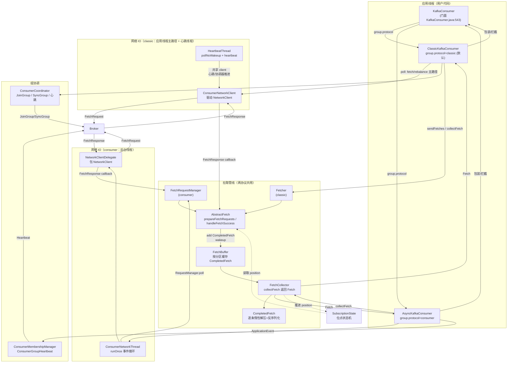

### 1.1 与生产者链路的对照

| 维度 | 生产者（Producer） | 消费者（Consumer） |
|---|---|---|
| 核心线程 | 用户线程 + 独立 Sender 线程 | classic：应用线程驱动；consumer：后台网络线程 |
| 网络请求驱动 | Sender.runOnce 轮询 | poll() 循环 / 网络线程事件循环 |
| 批处理 | RecordAccumulator 攒批 | Broker 端已经攒好批（RecordBatch） |
| 内存背压 | BufferPool（buffer.memory 硬上限） | FetchBuffer 按分区最多 1 个 CompletedFetch（有界） |
| 压缩 | 压缩后发给 broker | **解压发生在客户端**（惰性、逐条） |
| 位点 | 无（broker 分配 offset） | SubscriptionState 管理 position / committed |

---

## 2. 线程模型

### 2.1 classic 协议：poll 驱动 + 心跳线程

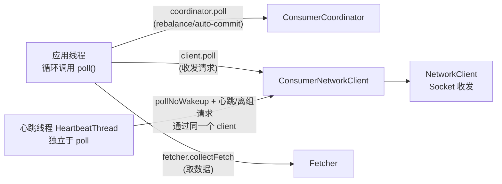

要点：

1. **数据拉取与 rebalance 主路径发生在应用线程内**——`ConsumerNetworkClient.poll()` 直接驱动底层 `NetworkClient`（`ConsumerNetworkClient.java:252-317`）。应用不 poll，fetch 响应收集、rebalance 回调、自动提交等前台流程就无法继续推进。
2. **心跳线程**（`HeartbeatThread`）也会调用 `client.pollNoWakeup()` 并发送心跳与 LeaveGroup，使"应用卡死但进程活着"时 broker 仍能感知（session.timeout 触发踢出）。
3. 应用线程通过 `acquire()`/`release()` 的**轻量级锁**（非阻塞，CAS + 引用计数）禁止多线程并发使用同一个 consumer（`AsyncKafkaConsumer.java:2216-2233`、`ClassicKafkaConsumer` 同款实现）。多线程共享 consumer 会抛 `ConcurrentModificationException`。

### 2.2 consumer 协议（KIP-848）：应用线程 + 后台网络线程

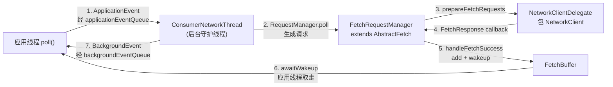

- 应用线程与网络线程通过**两个队列**通信：`ApplicationEvent`（应用→网络：发 fetch 请求、提交位点、seek 等）和 `BackgroundEvent`（网络→应用：分配变更、错误、rebalance 回调）。
- 网络线程主循环 `ConsumerNetworkThread.runOnce()`（`ConsumerNetworkThread.java:210-242`）：处理应用事件 → 逐个 RequestManager 生成请求 → `networkClientDelegate.poll(...)` 收发 → 清理过期事件。
- 应用线程等待数据用 `fetchBuffer.awaitWakeup(timer)`（`AsyncKafkaConsumer.java:2018`），网络线程收到响应后由 `FetchRequestManager` 复用 `AbstractFetch.handleFetchSuccess()`，把 `CompletedFetch` 加入 `FetchBuffer` 并 `wakeup()` 唤醒（`AbstractFetch.java:227-234`）。
- 好处：`poll()` 的语义不再是"驱动 IO"，而是"取回已就绪数据"；即使应用卡住，后台线程仍维持心跳，**大幅减少误踢**。代价：多一个线程与事件系统。

> 注意：classic 是 4.4 的默认协议（`ConsumerConfig.java:121-123`）。本文后续主线讲 classic，KIP-848 细节在 [第 14 节](#14-kip-848-新协议asynckafkaconsumer)。

---

## 3. 入口：KafkaConsumer 与协议选择

### 3.1 构造与协议分发

`KafkaConsumer` 的构造器最终走到 `ConsumerDelegateCreator.create()`（`KafkaConsumer.java:543`），按 `group.protocol` 二选一：

```java
// KafkaConsumer.java:543（逻辑示意，非逐字源码）
private static final ConsumerDelegateCreator CREATOR = new ConsumerDelegateCreator();
// CREATOR.create(config, ...) 内部：
//   GroupProtocol.CLASSIC  → new ClassicKafkaConsumer(config, ...)
//   GroupProtocol.CONSUMER → new AsyncKafkaConsumer(config, ...)
```

两条协议对配置的支持有互斥约束（`ConsumerConfig.java:404-419`）：

| 配置项 | classic | consumer |
|---|---|---|
| `partition.assignment.strategy` | 支持 | **不支持**（改由 broker 端 `group.consumer.assignors` 决定） |
| `heartbeat.interval.ms` / `session.timeout.ms` | 支持 | **不支持**（KIP-848 由服务端控制） |
| `group.remote.assignor` | 不支持 | 支持 |

设置了不兼容配置会直接抛 `ConfigException`（`ConsumerConfig.java:803-817`）。

### 3.2 订阅三态

`KafkaConsumer` 的 API 面（`KafkaConsumer.java`）：

- `subscribe(Collection<String>)`：**订阅模式**——由消费组自动分配分区（可能被 rebalance 移走/新增）。
- `assign(Collection<TopicPartition>)`：**手动指派**——绕过组协调器，无 rebalance；classic 与 consumer 两种实现都支持。
- `unsubscribe()`：清空订阅。

无论哪种模式，最终都落到 `SubscriptionState` 这个唯一事实源上（见[第 12 节](#12-位点管理subscriptionstate)）。

---

## 4. Classic 主循环：poll

`ClassicKafkaConsumer.poll(Duration)`（`ClassicKafkaConsumer.java:641-689`）是经典协议的发动机。骨架如下：

```java
// ClassicKafkaConsumer.java:648-689（关键行注释）
private ConsumerRecords<K, V> poll(final Timer timer) {
    acquireAndEnsureOpen();                       // 轻量锁 + 判未关闭
    try {
        do {
            client.maybeTriggerWakeup();          // wakeup() 的异常在此抛出
            updateAssignmentMetadataIfNeeded(timer, false);   // ① 协调器：rebalance + 位点
            final Fetch<K, V> fetch = pollForFetches(timer);  // ② 网络：收发 + 收集
            if (!fetch.isEmpty()) {
                if (sendFetches() > 0 || client.hasPendingRequests())
                    client.transmitSends();       // ③ 预取：趁用户处理数据先发下一轮
                return this.interceptors.onConsume(
                    new ConsumerRecords<>(fetch.records(), fetch.nextOffsets()));  // ④ 拦截器
            }
        } while (timer.notExpired());
        return ConsumerRecords.empty();
    } finally {
        release();
    }
}
```

三个步骤的职责划分：

### 4.1 ① updateAssignmentMetadataIfNeeded —— 组内事务

```java
// ClassicKafkaConsumer.java:696-702
boolean updateAssignmentMetadataIfNeeded(final Timer timer, final boolean waitForJoinGroup) {
    if (coordinator != null && !coordinator.poll(timer, waitForJoinGroup)) {
        return false;
    }
    return updateFetchPositions(timer);   // 校验/初始化各分区位点
}
```

`ConsumerCoordinator.poll(timer, false)`（`ConsumerCoordinator.java:513-579`）做了三件事，详见[第 6 节](#6-组协调consumercoordinator)：

1. 心跳时钟推进（`pollHeartbeat`，525 行）；
2. 需要 rejoin 时执行 `ensureActiveGroup()`（554 行，JoinGroup/SyncGroup 全套）；
3. `maybeAutoCommitOffsetsAsync(now)` 到点自动提交（577 行）。

`updateFetchPositions` 负责为"还没有合法位点"的分区初始化位点：有 committed 用 committed，没有则按 `auto.offset.reset` 策略查 earliest/latest（`Fetcher`/`OffsetFetcher` 内部实现，`ClassicKafkaConsumer.java:1208-1227`）。

### 4.2 ② pollForFetches —— 网络收发 + 收集数据

```java
// ClassicKafkaConsumer.java:707-740
private Fetch<K, V> pollForFetches(Timer timer) {
    long pollTimeout = coordinator == null ? timer.remainingMs() :
            Math.min(coordinator.timeToNextPoll(timer.currentTimeMs()), timer.remainingMs());

    // 快路径：缓冲区里已有数据，直接收集返回（不走网络）
    final Fetch<K, V> fetch = fetcher.collectFetch();
    if (!fetch.isEmpty()) {
        return fetch;
    }

    sendFetches();                    // 向各 leader broker 发 FetchRequest
    if (!cachedSubscriptionHasAllFetchPositions && pollTimeout > retryBackoffMs) {
        pollTimeout = retryBackoffMs; // 位点缺失时缩短等待，尽快重试
    }

    Timer pollTimer = time.timer(pollTimeout);
    client.poll(pollTimer, () -> {
        // 响应到达 → CompletedFetch 入队 → 条件满足，提前结束阻塞
        return !fetcher.hasAvailableFetches();
    });
    timer.update(pollTimer.currentTimeMs());
    return fetcher.collectFetch();    // 再收集一次（网络返回的新数据）
}
```

三个值得注意的设计：

1. **快路径**（712-715 行）：上一次 poll 没取完的数据留在 FetchBuffer 里，本次直接收集返回，**完全不碰网络**。
2. **PollCondition 提前唤醒**（732-736 行）：`client.poll` 的阻塞条件写的是"缓冲区里还没有可用数据才继续阻塞"——响应一到、`CompletedFetch` 入队，poll 立刻返回，而不是傻等到超时。
3. **pollTimeout 受协调器约束**（708-709 行）：不能比 `coordinator.timeToNextPoll()` 更长，否则会错过心跳/自动提交的时间窗。

### 4.3 ③ 预取（sendFetches + transmitSends）

poll 拿到数据准备返回给用户前，**先把下一轮 FetchRequest 发出去**（`ClassicKafkaConsumer.java:671-673`）。这样用户处理本轮数据的耗时与网络往返重叠——这是消费端吞吐的关键设计（pipelining）。

### 4.4 ④ 拦截器

`interceptors.onConsume(new ConsumerRecords<>(...))`（680 行）执行 `ConsumerInterceptor.onConsume`，可对整批记录做修改/过滤（例如审计、延迟统计）。拦截器链在 `ConsumerInterceptors` 中维护。

---

## 5. 网络层：ConsumerNetworkClient

`ConsumerNetworkClient` 是 classic 消费者的网络门面，本质是"带回调管理、请求超时、断连处理的 NetworkClient 封装"。

### 5.1 poll 主流程

```java
// ConsumerNetworkClient.java:262-317（关键行注释）
public void poll(Timer timer, PollCondition pollCondition, boolean disableWakeup) {
    firePendingCompletedRequests();          // 先触发上一轮攒下的响应回调

    lock.lock();
    try {
        handlePendingDisconnects();          // 断连→ 失败相关在途请求
        long pollDelayMs = trySend(timer.currentTimeMs());   // 把 unsent 请求发出去

        if (pendingCompletion.isEmpty() && (pollCondition == null || pollCondition.shouldBlock())) {
            long pollTimeout = Math.min(timer.remainingMs(), pollDelayMs);
            if (client.inFlightRequestCount() == 0)
                pollTimeout = Math.min(pollTimeout, retryBackoffMs);  // 无在途请求时不长等
            client.poll(pollTimeout, timer.currentTimeMs());          // 真正做 select/send/recv
        } else {
            client.poll(0, timer.currentTimeMs());
        }
        timer.update();

        checkDisconnects(timer.currentTimeMs());   // 断连检查必须在 ready() 之前
        if (!disableWakeup) {
            maybeTriggerWakeup();                  // wakeup() 标记 → 抛 WakeupException
        }
        maybeThrowInterruptException();            // 线程被中断 → InterruptException

        trySend(timer.currentTimeMs());            // 缓冲释放/连接建立后再试一次发送
        failExpiredRequests(timer.currentTimeMs()); // 超时未发出的请求 → TimeoutException
        unsent.clean();
    } finally {
        lock.unlock();
    }

    firePendingCompletedRequests();                // 响应回调（无锁，避免死锁）
    metadata.maybeThrowAnyException();             // 元数据错误上抛
}
```

### 5.2 请求生命周期

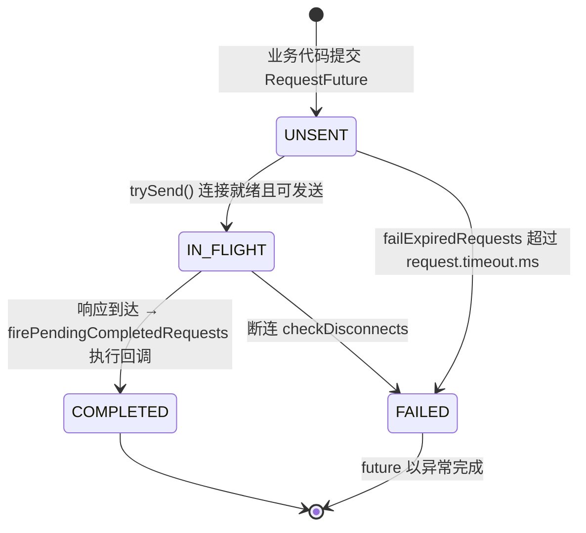

关键点：

- **所有异步请求都以 `RequestFuture`/回调形式登记**（`pendingCompletion`、`unsent` 两个集合），poll 循环负责推进。
- `failExpiredRequests`（305 行）保证**请求不可能永久挂着**——超过 `request.timeout.ms`（默认 30000ms）未发出即失败。
- 回调在**无锁**状态下执行（314 行），避免回调里再调用 client 方法造成死锁。

---

## 6. 组协调：ConsumerCoordinator

`ConsumerCoordinator` 是 classic 协议的"大脑"，负责：找协调器、JoinGroup、SyncGroup、心跳、rebalance 回调、自动提交。

### 6.1 poll 内的协调逻辑

```java
// ConsumerCoordinator.java:513-579（关键行注释）
public boolean poll(Timer timer, boolean waitForJoinGroup) {
    maybeUpdateSubscriptionMetadata();        // 订阅 topic 元数据（订阅集变化检测）
    invokeCompletedOffsetCommitCallbacks();   // 执行已完成提交的回调

    if (subscriptions.hasAutoAssignedPartitions()) {   // 订阅模式才做组管理
        if (protocol == null) throw new IllegalStateException(...);
        pollHeartbeat(timer.currentTimeMs());          // 喂狗：推进心跳线程时钟
        if (coordinatorUnknownAndUnreadySync(timer)) {
            return false;                              // 找不到协调器 → 本次跳过
        }
        if (rejoinNeededOrPending()) {
            if (subscriptions.hasPatternSubscription()) {
                if (this.metadata.timeToAllowUpdate(timer.currentTimeMs()) == 0) {
                    this.metadata.requestUpdate(true);   // 正则订阅先刷新元数据
                }
                if (!client.ensureFreshMetadata(timer)) return false;
                maybeUpdateSubscriptionMetadata();
            }
            if (!ensureActiveGroup(waitForJoinGroup ? timer : time.timer(0L))) {
                timer.update(time.milliseconds());
                return false;                          // 本次 poll 不等待入组完成
            }
        }
    } else {
        // assign 模式：不找协调器，只按需刷新元数据
        if (metadata.updateRequested() && !client.hasReadyNodes(timer.currentTimeMs())) {
            client.awaitMetadataUpdate(timer);
        }
        client.pollNoWakeup();
    }

    maybeAutoCommitOffsetsAsync(timer.currentTimeMs());  // 到点自动提交
    return true;
}
```

### 6.2 rebalance 状态机（classic）

`ensureActiveGroup()` 内部是经典的两阶段提交式 rebalance：

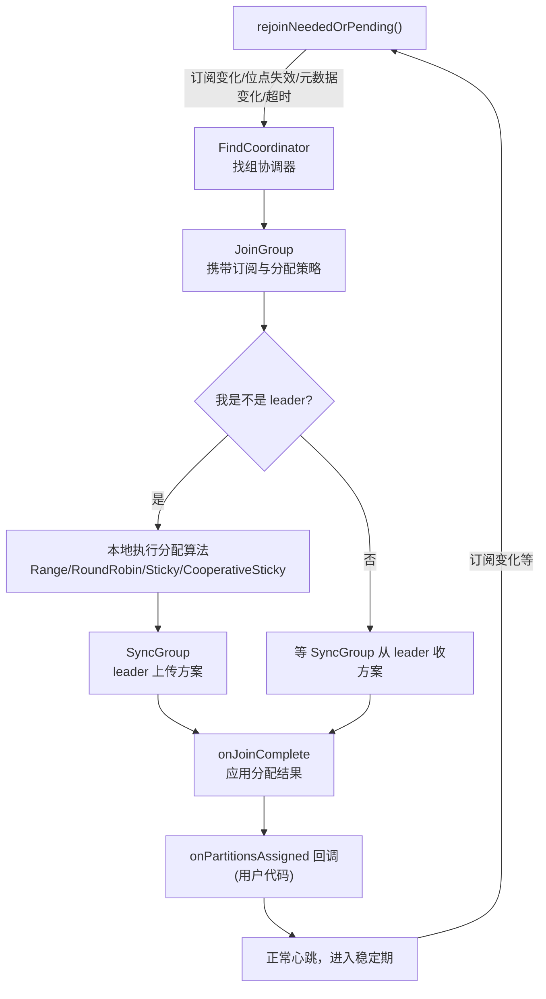

几个实现细节：

- **分配算法在客户端执行**（leader 消费端本地跑 `RangeAssignor` 等，`ConsumerConfig.java:157-172` 默认 `[RangeAssignor, CooperativeStickyAssignor]`）——这与 KIP-848 的"服务端分配"完全不同。
- `onJoinComplete`（`ConsumerCoordinator.java:379-383`）里完成：应用新分配 → 触发 `onPartitionsAssigned` 回调 → 重置心跳。
- **心跳由独立线程**（HeartbeatThread）发送：`pollHeartbeat`（525 行）只是把"最近一次 poll 时间"喂给心跳线程；若应用超过 `max.poll.interval.ms`（默认 300000ms）不 poll，心跳线程会主动 LeaveGroup，组重平衡。
- `session.timeout.ms`（默认 45000）是"心跳彻底消失多久后 broker 判定死亡"，与 `max.poll.interval.ms`（应用主动离组）是两个概念。

### 6.3 自动提交的调度

```java
// ConsumerCoordinator.java:586-591
public long timeToNextPoll(long now) {
    if (!autoCommitEnabled)
        return timeToNextHeartbeat(now);
    return Math.min(nextAutoCommitTimer.remainingMs(), timeToNextHeartbeat(now));
}
```

`nextAutoCommitTimer` 按 `auto.commit.interval.ms`（默认 5000ms）重置。`maybeAutoCommitOffsetsAsync(now)`（`ConsumerCoordinator.java:1202-1252`）到期时提交 `subscriptions.allConsumed()` 记录的位点——注意这是**异步、尽力而为**的，失败只记日志不重试（见[第 13 节](#13-位点提交自动提交与手动提交)）。

---

## 7. 拉取：AbstractFetch / Fetcher

### 7.1 Fetcher 的组成

`Fetcher`（`Fetcher.java:59`，211 行）extends `AbstractFetch`（650 行），是 classic 协议的拉取实现；KIP-848 侧对应 `FetchRequestManager`（也 extends `AbstractFetch`）。真正的大头逻辑都在 `AbstractFetch` 里：

| 成员 | 作用 | 位置 |
|---|---|---|
| `fetchBuffer` | 已完成拉取的队列 | `AbstractFetch.java:77` |
| `decompressionBufferSupplier` | 解压中间缓冲池（每 fetch 一个，**共享给所有分区**） | `AbstractFetch.java:78,100` |
| `sessionHandlers` | 每 broker 的 Fetch Session（增量 fetch 会话） | `AbstractFetch.java:81` |
| `nodesWithPendingFetchRequests` | 在途请求去重 | `AbstractFetch.java:79` |

### 7.2 发请求：prepareFetchRequests

```java
// AbstractFetch.java:421-488（关键行注释）
protected Map<Node, FetchSessionHandler.FetchRequestData> prepareFetchRequests() {
    // 有缓冲数据的分区不发新请求（用户还没消费完）
    Set<TopicPartition> buffered = Collections.unmodifiableSet(fetchBuffer.bufferedPartitions());
    List<TopicPartition> unbuffered = fetchablePartitions(buffered);   // 346-353 行

    for (TopicPartition partition : unbuffered) {
        SubscriptionState.FetchPosition position = positionForPartition(partition);
        Optional<Node> nodeOpt = maybeNodeForPosition(partition, position, currentTimeMs);
        ...
        if (isUnavailable(node)) { ... }                       // 重连退避期跳过
        else if (nodesWithPendingFetchRequests.contains(node.id())) { ... }  // 已有在途请求
        else if (bufferedNodes.contains(node.id())) { ... }    // 同 broker 有缓冲数据则跳过
        else {
            FetchRequest.PartitionData partitionData = new FetchRequest.PartitionData(
                topicId, position.offset, ..., fetchConfig.fetchSize,
                position.currentLeader.epoch, Optional.empty());
            builder.add(partition, partitionData);
        }
    }
    return convert(fetchable);
}
```

**"每分区最多一个在途/缓冲批次"** 是核心约束：某分区数据已被拉回但用户没消费完，就不再拉该分区（避免位点乱序与内存膨胀）。请求参数里 `fetchConfig.fetchSize` 即 `max.partition.fetch.bytes`（默认 1MB）。

### 7.3 收响应：handleFetchSuccess

```java
// AbstractFetch.java:151-257（关键行注释）
protected void handleFetchSuccess(final Node fetchTarget,
                                  final FetchSessionHandler.FetchRequestData data,
                                  final ClientResponse resp) {
    try {
        ...
        for (Map.Entry<TopicPartition, FetchResponseData.PartitionData> entry : responseData.entrySet()) {
            ...
            CompletedFetch completedFetch = new CompletedFetch(
                    completedFetchLog, subscriptions,
                    decompressionBufferSupplier,     // ← 共享解压缓冲
                    partition, partitionData, metricAggregator, fetchOffset);
            fetchBuffer.add(completedFetch);         // ← 入队即“完成”
            needsWakeup = false;
        }
        if (needsWakeup)
            fetchBuffer.wakeup();                    // 空响应也要唤醒等待者
        ...
    } finally {
        removePendingFetchRequest(fetchTarget, data.metadata().sessionId());
    }
}
```

注意几个点：

1. **响应不在此处解压**——只是把原始字节（仍压缩）包成 `CompletedFetch` 放进缓冲。解压被推迟到真正逐条读取时（惰性，见[第 10/11 节](#10-逐条解析completedfetch)）。
2. 每个分区的 `CompletedFetch` 都拿到**同一个** `decompressionBufferSupplier`——解压中间缓冲是全 consumer 共享复用的（`AbstractFetch.java:100` 只 create 一次）。
3. **空响应也要 wakeup**（233-234 行）：否则等待数据的应用线程会一直睡到 poll 超时。
4. leader 变更（`NOT_LEADER_OR_FOLLOWER` 等）时更新元数据并触发位点重新校验（`maybeValidatePositionForCurrentLeader`，250 行）——防止"换主后 offset 含义变化"的数据错乱。

---

## 8. 缓冲：FetchBuffer

`FetchBuffer`（`FetchBuffer.java:50`）是应用线程与网络之间的数据缓冲，**线程安全**：

```java
// FetchBuffer.java:53-67
private final ConcurrentLinkedQueue<CompletedFetch> completedFetches;
private final Lock lock;
private final Condition blockingCondition;
private final AtomicBoolean wokenup = new AtomicBoolean(false);
private CompletedFetch nextInLineFetch;   // 当前正在逐条消费的那个
```

### 8.1 队列语义

- **completedFetches**：按分区排队的已完成拉取；`prepareFetchRequests` 会跳过已缓冲分区与 paused 分区，通常避免同一分区继续堆积新 fetch。注意这个约束来自拉取选择逻辑，不是 `FetchBuffer` 自身的硬去重结构。
- **nextInLineFetch**：`FetchCollector` 逐条消费时的"当前批次指针"。一次 poll 只消费到 `max.poll.records` 为止，**没消费完的批次保留在 nextInLineFetch 跨 poll 存活**——这是"惰性解压流跨 poll 打开"的根源（zstd 专题的关键）。

### 8.2 等待/唤醒

```java
// FetchBuffer.java:165-194  awaitWakeup：KIP-848 下应用线程等待网络线程投递数据
// FetchBuffer.java:196-204  wakeup：FetchResponse 处理完成后唤醒等待者
```

`wokenup` 标志 + `Condition`：KIP-848 下应用线程 `awaitWakeup(timer)` 睡到"响应入队"或超时；`addAll` 时置位唤醒（102-114 行）。classic 路径主要在应用线程自己的 `client.poll` 中等待，`wakeup()` 对等待型路径更关键。

### 8.3 清理：retainAll —— 资源释放的总闸门

```java
// FetchBuffer.java:212-223
void retainAll(final Set<TopicPartition> partitions) {
    lock.lock();
    try {
        completedFetches.removeIf(cf -> maybeDrain(partitions, cf));
        if (maybeDrain(partitions, nextInLineFetch))
            nextInLineFetch = null;
    } finally {
        lock.unlock();
    }
}

// FetchBuffer.java:229-237
private boolean maybeDrain(final Set<TopicPartition> partitions, final CompletedFetch completedFetch) {
    if (completedFetch != null && !partitions.contains(completedFetch.partition)) {
        completedFetch.drain();   // ← 关闭解压流等资源
        return true;
    }
    return false;
}
```

调用时机：订阅变更（`AsyncKafkaConsumer.java:2306`）、关闭（`FetchBuffer.close()` 传空集合 → 全部 drain，262-273 行）。**`drain()` 是 CompletedFetch 释放解压流的唯一入口**——详见[第 17 节](#17-专题zstd-解压资源释放与-oom-修复)。

---

## 9. 收集：FetchCollector

`FetchCollector.collectFetch(FetchBuffer)`（`FetchCollector.java:91-147`）是"把原始字节变成 ConsumerRecords"的编排器，在应用线程执行：

```java
// FetchCollector.java:91-147（关键行注释）
public Fetch<K, V> collectFetch(final FetchBuffer fetchBuffer) {
    final Fetch<K, V> fetch = Fetch.empty();
    final Queue<CompletedFetch> pausedCompletedFetches = new ArrayDeque<>();
    int recordsRemaining = fetchConfig.maxPollRecords;   // 预算：max.poll.records

    try {
        while (recordsRemaining > 0) {
            final CompletedFetch nextInLineFetch = fetchBuffer.nextInLineFetch();

            if (nextInLineFetch == null || nextInLineFetch.isConsumed()) {
                final CompletedFetch completedFetch = fetchBuffer.peek();
                if (completedFetch == null) break;         // 队列空，收工

                if (!completedFetch.isInitialized()) {
                    try {
                        fetchBuffer.setNextInLineFetch(initialize(completedFetch));
                    } catch (Exception e) {
                        // 初始化抛异常（如 CORRUPT_MESSAGE、无权限）：
                        // 仅当“尚未返回任何数据且响应无字节”时才摘除，避免消费者被卡死
                        if (fetch.isEmpty() && FetchResponse.recordsOrFail(completedFetch.partitionData).sizeInBytes() == 0)
                            fetchBuffer.poll();
                        throw e;
                    }
                } else {
                    fetchBuffer.setNextInLineFetch(completedFetch);
                }
                fetchBuffer.poll();                        // 从队列摘出，进入逐条消费
            } else if (subscriptions.isPaused(nextInLineFetch.partition)) {
                // 暂停的分区：数据原样放回队列，恢复后继续消费
                pausedCompletedFetches.add(nextInLineFetch);
                fetchBuffer.setNextInLineFetch(null);
            } else {
                final Fetch<K, V> nextFetch = fetchRecords(nextInLineFetch, recordsRemaining);
                recordsRemaining -= nextFetch.numRecords();
                fetch.add(nextFetch);
            }
        }
    } catch (KafkaException e) {
        if (fetch.isEmpty()) throw e;    // 一条都没取到 → 异常上抛；已取到部分 → 先返回已取的
    } finally {
        fetchBuffer.addAll(pausedCompletedFetches);   // 暂停分区数据放回队列
    }
    return fetch;
}
```

### 9.1 initialize —— 与 SubscriptionState 对账

```java
// FetchCollector.java:222-283（关键行注释）
protected CompletedFetch initialize(final CompletedFetch completedFetch) {
    final Errors error = Errors.forCode(completedFetch.partitionData.errorCode());
    try {
        if (!subscriptions.hasValidPosition(tp)) {
            return null;   // rebalance 期间位点失效 → 丢弃该批
        } else if (error == Errors.NONE) {
            return handleInitializeSuccess(completedFetch);
        } else {
            handleInitializeErrors(completedFetch, error);
            return null;
        }
    } finally { ... }
}

// handleInitializeSuccess 的核心对账（252-283 行）：
//   1. position.offset != fetchOffset → 过期响应，丢弃（返回 null）
//   2. 更新 highWatermark / logStartOffset / lastStableOffset（285-319 行）
//   3. 标记 initialized
```

对账失败（位点不匹配）的批次在 `fetchRecords` 的兜底路径被 `drain()`（见 9.2）。

错误处理（`handleInitializeErrors`，321-388 行）值得单独列一张表：

| 错误码 | 处理 |
|---|---|
| NOT_LEADER_OR_FOLLOWER / FENCED_LEADER_EPOCH / KAFKA_STORAGE_ERROR 等 | 请求元数据更新，静默丢弃 |
| OFFSET_OUT_OF_RANGE | 有 reset 策略 → 重置位点；否则抛 `OffsetOutOfRangeException` |
| TOPIC_AUTHORIZATION_FAILED | 抛 `TopicAuthorizationException` |
| CORRUPT_MESSAGE | 抛 `KafkaException`（消费端遇坏消息的典型表现） |

### 9.2 fetchRecords —— 逐条消费 + 位点推进

```java
// FetchCollector.java:149-217（关键行注释）
private Fetch<K, V> fetchRecords(final CompletedFetch nextInLineFetch, int maxRecords) {
    final TopicPartition tp = nextInLineFetch.partition;

    if (!subscriptions.isAssigned(tp)) {
        // rebalance 后分区已被拿走 → 丢弃
    } else if (!subscriptions.isFetchable(tp)) {
        // 被 pause / 位点重置中 / 订阅变更 → 丢弃
    } else {
        SubscriptionState.FetchPosition position = subscriptions.position(tp);
        if (position == null)
            throw new IllegalStateException("Missing position for fetchable partition " + tp);

        if (nextInLineFetch.nextFetchOffset() == position.offset) {
            List<ConsumerRecord<K, V>> partRecords =
                nextInLineFetch.fetchRecords(fetchConfig, deserializers, maxRecords);

            if (nextInLineFetch.nextFetchOffset() > position.offset) {
                // 消费了多少，位点就推进多少（按返回记录推进，不是按拉取量）
                subscriptions.position(tp, new SubscriptionState.FetchPosition(
                        nextInLineFetch.nextFetchOffset(),
                        nextInLineFetch.lastEpoch(),
                        position.currentLeader));
                positionAdvanced = true;
            }

            if (nextInLineFetch.isExhausted()) {
                nextInLineFetch.drain();   // ← 整批读完：关闭解压流
            }

            // 记录 lag / lead 指标（195-202 行）
            return Fetch.forPartition(tp, partRecords, positionAdvanced, ...);
        } else {
            // 位点不匹配（过期响应）→ 忽略并丢弃
        }
    }

    nextInLineFetch.drain();   // 未赋值/不可拉取/位点不匹配 → 全部 drain 释放资源
    return Fetch.empty();
}
```

**位点推进的语义**：`subscriptions.position` 按**实际返回给用户的记录**推进（178-187 行）。没返回（pause、丢弃）就不推进——保证 `position` 永远是"下一条该消费的 offset"。

**drain 的四个触发点**（都在这里或 collectFetch 中）：

1. 整批读尽（191-193 行）；
2. 分区已不 assigned / 不可 fetchable（214 行）；
3. 位点不匹配的过期批（214 行）；
4. FetchBuffer.retainAll 清理（[第 8.3 节](#83-清理retainall--资源释放的总闸门)）。

---

## 10. 逐条解析：CompletedFetch

`CompletedFetch`（`CompletedFetch.java:59`）代表"一个分区的一批已拉取数据"，是**惰性解压 + 逐条反序列化**的执行体。

### 10.1 状态字段

```java
// CompletedFetch.java:72-83
private int recordsRead;
private int bytesRead;
private RecordBatch currentBatch;              // 当前批次（可能仍压缩）
private Record lastRecord;
private CloseableIterator<Record> records;     // ← 当前批次的流式迭代器（zstd 流就在这里）
private Exception cachedRecordException = null;
private boolean corruptLastRecord = false;
private long nextFetchOffset;                  // 下一条该消费的 offset
private Optional<Integer> lastEpoch;
private volatile boolean isConsumed = false;   // 已 drain
private boolean exhausted = false;             // 所有批次读尽
private boolean initialized = false;
```

### 10.2 nextFetchedRecord —— 惰性解压引擎

```java
// CompletedFetch.java:187-244（关键行注释）
private Record nextFetchedRecord(FetchConfig fetchConfig) {
    while (true) {
        if (records == null || !records.hasNext()) {
            maybeCloseRecordStream();          // 上一批迭代器关闭（解压流关闭）

            if (!batches.hasNext()) {
                // 所有批次读完：nextFetchOffset = currentBatch.nextOffset()
                exhausted = true;
                return null;
            }

            currentBatch = batches.next();
            lastEpoch = maybeLeaderEpoch(currentBatch.partitionLeaderEpoch());
            maybeEnsureValid(fetchConfig, currentBatch);   // CRC 校验（check.crcs）

            if (fetchConfig.isolationLevel == IsolationLevel.READ_COMMITTED && currentBatch.hasProducerId()) {
                // 事务过滤：跳过 aborted 批次（208-224 行）
                consumeAbortedTransactionsUpTo(currentBatch.lastOffset());
                if (isBatchAborted(currentBatch)) { nextFetchOffset = currentBatch.nextOffset(); continue; }
            }

            records = currentBatch.streamingIterator(decompressionBufferSupplier);  // ← 打开解压流
        } else {
            Record record = records.next();    // 逐条从解压流读出
            if (record.offset() >= nextFetchOffset) {
                maybeEnsureValid(fetchConfig, record);          // 单条 CRC
                if (!currentBatch.isControlBatch()) {
                    return record;                             // 控制消息（abort marker 等）不返回
                } else {
                    nextFetchOffset = record.offset() + 1;
                }
            }
        }
    }
}
```

流程要点：

1. **解压流按批次打开**（226 行）：`streamingIterator` 在"首次需要该批次数据"时才创建，此时 `ZstdInputStreamNoFinalizer` 的 native 上下文开始占用内存。
2. **批间切换先关旧流**（190 行 `maybeCloseRecordStream`）：同一时刻最多一个流打开。
3. **事务过滤**（208-224 行）：`read_committed` 下根据 `AbortedTransaction` 列表跳过已中止批次；abort control marker 属于控制批次，不返回给用户（235-240 行）。
4. **惰性**：一条 fetch 响应可能包含多个批次，但只有用户消费到哪，解压才推进到哪。

### 10.3 fetchRecords —— 反序列化循环

```java
// CompletedFetch.java:257-307（关键行注释）
<K, V> List<ConsumerRecord<K, V>> fetchRecords(FetchConfig fetchConfig,
                                               Deserializers<K, V> deserializers,
                                               int maxRecords) {
    if (corruptLastRecord)
        throw new KafkaException("Received exception when fetching the next record from " + partition
                + ". If needed, please seek past the record to continue consumption.", cachedRecordException);

    if (isConsumed)
        return Collections.emptyList();

    List<ConsumerRecord<K, V>> records = new ArrayList<>();
    try {
        for (int i = 0; i < maxRecords; i++) {
            if (cachedRecordException == null) {
                corruptLastRecord = true;
                lastRecord = nextFetchedRecord(fetchConfig);
                corruptLastRecord = false;
            }
            if (lastRecord == null) break;
            ...
            ConsumerRecord<K, V> record = parseRecord(deserializers, partition, leaderEpoch, timestampType, lastRecord);
            records.add(record);
            recordsRead++;
            bytesRead += lastRecord.sizeInBytes();
            nextFetchOffset = lastRecord.offset() + 1;
            cachedRecordException = null;   // 反序列化成功后清零，允许下一条前进
        }
    } catch (SerializationException se) {
        cachedRecordException = se;
        if (records.isEmpty()) throw se;   // 一条都没成 → 直接抛；否则返回已成功的
    } catch (KafkaException e) {
        cachedRecordException = e;
        if (records.isEmpty())
            throw new KafkaException("Received exception when fetching the next record from " + partition
                    + ". If needed, please seek past the record to continue consumption.", e);
    }
    return records;
}
```

反序列化在 `parseRecord`（312-339 行）中执行：

```java
key = keyBytes == null ? null : deserializers.keyDeserializer().deserialize(partition.topic(), headers, keyBytes);
value = valueBytes == null ? null : deserializers.valueDeserializer().deserialize(partition.topic(), headers, valueBytes);
return new ConsumerRecord<>(topic, partition, offset, timestamp, timestampType,
        keySize, valueSize, key, value, headers, leaderEpoch);
```

**坏消息的重试语义**（`cachedRecordException` 机制）：

- 反序列化抛 `SerializationException` 时，异常被缓存，**下一条记录不再前进**——用户每次 poll 都会重新尝试反序列化同一条（275-279、293 行）。这是给"反序列化器偶发失败"留的活路。
- 用户要跳过坏消息，必须 `seek` 越过它，否则 poll 永久卡在同一条上。

---

## 11. 解压链路：zstd 是怎么解出来的

消费端收到的是**压缩后的批次字节**。解压路径如下：

```mermaid
flowchart LR
    A["CompletedFetch.nextFetchedRecord<br/>CompletedFetch.java:226"] -->|"streamingIterator(supplier)"| B["DefaultRecordBatch.streamingIterator<br/>DefaultRecordBatch.java:359-364"]
    B -->|"compressedIterator"| C["recordInputStream<br/>DefaultRecordBatch.java:273-277"]
    C -->|"Compression.of(type).build()"| D["CompressionType.ZSTD 工厂<br/>CompressionType.java:99-130"]
    D -->|"wrapForInput"| E["ZstdCompression.wrapForInput<br/>ZstdCompression.java:66-75"]
    E --> F["ChunkedBytesStream<br/>(外层，自定义缓冲流 16KB)"]
    F --> G["input = ZstdInputStreamNoFinalizer<br/>zstd-jni 1.5.6-10"]
    G --> H["ZstdDecompressCtx<br/>native 堆外内存"]
    F --> I["StreamRecordIterator<br/>DefaultRecordBatch.java:625-663"]
    I -->|"readFrom 逐条读 Record"| J["CompletedFetch.parseRecord<br/>反序列化为 ConsumerRecord"]
```

### 11.1 三层包装逐层拆解

**第一层：`CompressionType.ZSTD`**（`CompressionType.java:99-130`）

```java
ZSTD((byte) 4, "zstd", 1.0f) {
    private static final int MIN_LEVEL = -131072;   // 负值 = zstd 的“快速档”
    private static final int MAX_LEVEL = 22;
    private static final int DEFAULT_LEVEL = 3;
    ...
}
```

通过 `Compression.of(compressionType()).build()` 创建 `ZstdCompression`（level 默认 3）。

**第二层：`ZstdCompression.wrapForInput`**（`ZstdCompression.java:66-98`）

```java
@Override
public InputStream wrapForInput(ByteBuffer buffer, byte messageVersion, BufferSupplier decompressionBufferSupplier) {
    try {
        return new ChunkedBytesStream(wrapForZstdInput(buffer, decompressionBufferSupplier),
                decompressionBufferSupplier,
                decompressionOutputSize(),   // 16 * 1024
                false);
    } catch (Throwable e) {
        throw new KafkaException(e);
    }
}

public static ZstdInputStreamNoFinalizer wrapForZstdInput(ByteBuffer buffer, BufferSupplier decompressionBufferSupplier) throws IOException {
    // 用 Kafka 自己的 BufferSupplier 充当 zstd-jni 的 BufferPool：
    // 1) 读压缩数据前的输入缓冲  2) skip() 的临时缓冲
    final BufferPool bufferPool = new BufferPool() {
        @Override public ByteBuffer get(int capacity) { return decompressionBufferSupplier.get(capacity); }
        @Override public void release(ByteBuffer buffer) { decompressionBufferSupplier.release(buffer); }
    };
    return new ZstdInputStreamNoFinalizer(new ByteBufferInputStream(buffer), bufferPool);
}
```

**第三层：`ChunkedBytesStream`**（`ChunkedBytesStream.java:40-167`）

这是 Kafka 自研的 `BufferedInputStream` 替代品（注释 25-39 行说明缘由）：

- 中间缓冲（16KB，见 `ZstdCompression.decompressionOutputSize()`，106-109 行）来自 `BufferSupplier` 池化复用，避免每次 skip/read 分配；
- `close()` 时**先把中间缓冲还回 BufferSupplier，再关闭底层流**（156-167 行）；
- 因 zstd-jni 的 `skip()` 每次调用都要从缓冲池取/还缓冲，效率差，所以 `delegateSkipToSourceStream=false` 改为本地读+跳过（298-326 行）。

**第四层：`ZstdInputStreamNoFinalizer`**（zstd-jni 库，版本见 `gradle/dependencies.gradle:139` → **1.5.6-10**）

这是整个专题的核心。zstd-jni 提供两个流式解压类：

| 类 | finalize() | 释放机制 |
|---|---|---|
| `ZstdInputStream` | **有**——GC 时兜底关闭 native ctx | 显式 close() + finalizer 双保险 |
| `ZstdInputStreamNoFinalizer` | **无**——继承但置空 | **只有显式 close()** |

Kafka 在 `ZstdCompression.java:29,97` 用的是 **NoFinalizer 版**（finalizer 已被 JDK 18+ 废弃且性能差）。代价是：**一旦某个路径忘记 close()，native 内存永久泄漏，GC 救不了**。流内部持有 `ZstdDecompressCtx`（native 结构 + 解压窗口缓冲），窗口大小由帧头 windowLog 决定——Kafka 生产者默认 level=3 对应 windowLog=23，即 **每个打开的解压流最多可占约 8MB 堆外内存**（windowLog=27 上限时可达 128MB）。

### 11.2 关闭链（谁在什么时候关）

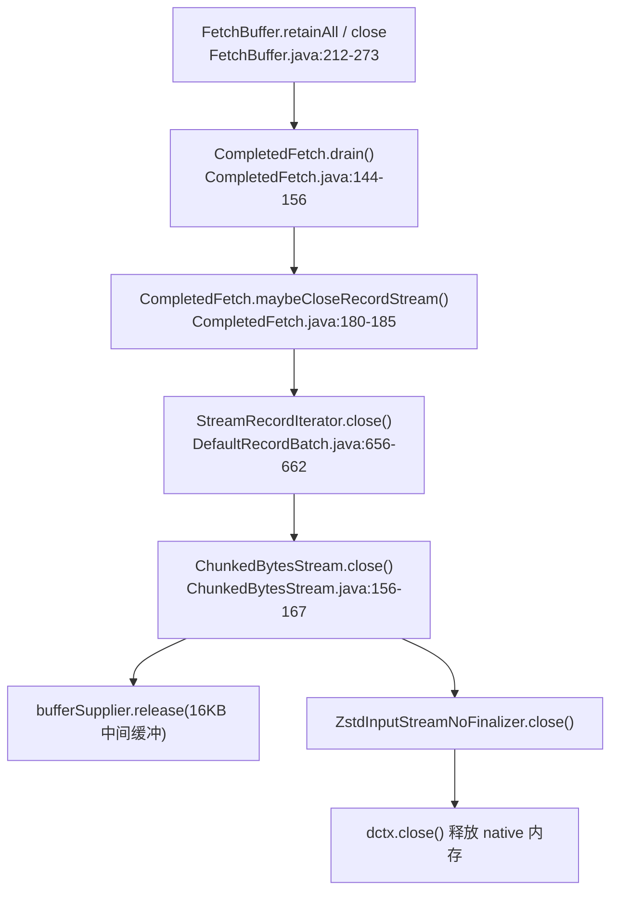

`drain()` 是总闸门（`CompletedFetch.java:138-156`）：

```java
void drain() {
    if (!isConsumed) {
        maybeCloseRecordStream();     // 关闭正在打开的解压迭代器
        cachedRecordException = null;
        this.isConsumed = true;
        recordAggregatedMetrics(bytesRead, recordsRead);
        if (bytesRead > 0)
            subscriptions.movePartitionToEnd(partition);
    }
}
```

**只要 drain 被调用，native 内存必然释放**。泄漏问题等价于："哪些路径会漏掉 drain / 延迟 drain"——这正是[第 17 节](#17-专题zstd-解压资源释放与-oom-修复)要解决的。

---

## 12. 位点管理：SubscriptionState

`SubscriptionState`（`SubscriptionState.java`，1460 行）是消费端**唯一事实源**：订阅了什么、分配了什么、每个分区的消费位点、暂停状态，全在这里。所有方法 `synchronized`，应用线程与网络线程共用。

### 12.1 每个分区的状态机：FetchStates

```java
// SubscriptionState.java:1011-1041（TopicPartitionState 核心字段）
private FetchState fetchState;
private FetchPosition position;         // 上次消费位置（“下一条该消费的 offset”）
private Long highWatermark;             // 上次 fetch 响应的 HW
private Long logStartOffset;            // LSO（日志起始，用于 lag 计算）
private Long lastStableOffset;
private boolean paused;                 // 用户 pause
private boolean pendingRevocation;      // rebalance 中待回收
private AutoOffsetResetStrategy resetStrategy;
```

状态机（`FetchStates`，`SubscriptionState.java:1246` 附近 `shouldInitialize` 等）：

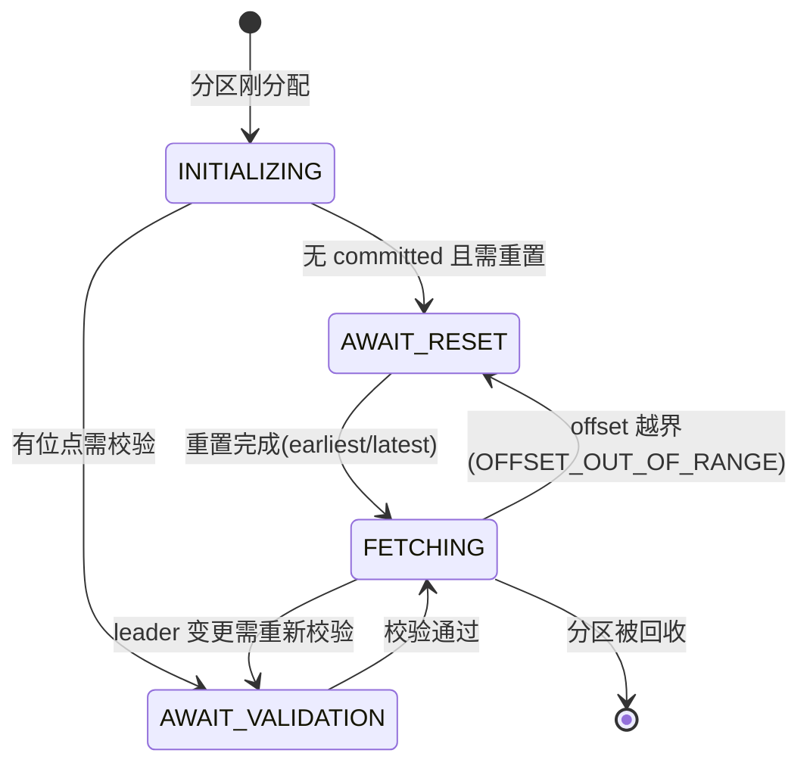

### 12.2 FetchPosition —— 位点的载体

```java
// SubscriptionState.java:1382-1391
public static class FetchPosition {
    public final long offset;                              // 下一条消费 offset
    public final Optional<Integer> offsetEpoch;            // leader epoch（KIP-320 安全位点）
    public final Metadata.LeaderAndEpoch currentLeader;    // 当前 leader + epoch
}
```

位点带 **leader epoch** 是 2.x 之后的重要安全机制：leader 变更后旧 offset 可能指向不同数据，因此换 leader 时位点进入 `AWAIT_VALIDATION`，向新 leader 校验 `(offset, epoch)` 是否有效（`maybeValidatePosition`，1109-1124 行），无效则回退。

### 12.3 三个位点概念

| 概念 | 含义 | 位置 |
|---|---|---|
| **position**（消费位置） | 下一条将要消费的 offset，poll 返回后推进 | `TopicPartitionState.position`（1014 行） |
| **committed**（已提交位点） | 上次成功提交给 broker 的 offset | `SubscriptionState` 的 committed 管理 |
| **highWatermark / logStartOffset** | broker 侧水位，用于算 lag | 1016-1017 行，`tryUpdatingHighWatermark` |

`partitionLag(tp, isolationLevel)`（`FetchCollector.java:195-197` 调用）：`read_uncommitted` 下 lag = HW - position；`read_committed` 下 lag = LSO - position。

### 12.4 seek 与暂停

- `seek`：应用线程直接改 position（`seekValidated`/`seekUnvalidated`，1194-1205 行；`seekUnvalidated` 同样触发 leader epoch 校验）。
- `pause/resume`：`pause` 后不会返回该分区记录，`FetchCollector.java:125-130` 会把已缓存的 `CompletedFetch` 放回队列；同时 `SubscriptionState.isFetchable()` 要求 `!paused`，后续新 fetch 选择会排除 paused 分区。也就是说，已进入 `FetchBuffer` 的数据会保留，`resume` 后接着消费，但不是无限继续拉取。

---

## 13. 位点提交：自动提交与手动提交

### 13.1 提交的是什么

提交的位点不是"当前读到哪"，而是 **`subscriptions.allConsumed()`**——所有分区 **position 的当前值**（即"下一条该消费的 offset"）。因为消费端拿到消息先攒批再异步处理时，若提交"已处理的最后一条 +1"，则 crash 后从提交位点恢复，未提交的重放——**至少一次**语义。

### 13.2 自动提交（classic 协议）

- 开关：`enable.auto.commit`（默认 true，`ConsumerConfig.java:464-468`）。
- 节奏：`auto.commit.interval.ms`（默认 5000ms）驱动的 `nextAutoCommitTimer`，在 `coordinator.poll()` 里检查（`ConsumerCoordinator.java:577`）。
- 性质：**异步、尽力而为**。失败只留日志（`maybeAutoCommitOffsetsAsync`，1202-1252 行），不重试、不抛异常——重试会导致乱序提交风险。
- 与 rebalance 的交互：classic 在 rejoin 前也会做一次提交（`onJoinPrepare` 前），减少重复消费窗口。
- **KIP-848 协议下自动提交的实现不同**：由 `CommitRequestManager.maybeAutoCommitAsync()`（`CommitRequestManager.java:277-320`）在后台线程周期执行；rebalance 前还会做 `maybeAutoCommitSyncBeforeRebalance`（330 行，`ConsumerMembershipManager.java:243` 调用）——同步提交成功后才会回收分区，**比 classic 更严格**。

### 13.3 手动提交

```java
// ClassicKafkaConsumer.java:758-772  commitSync 核心
public void commitSync(final Map<TopicPartition, OffsetAndMetadata> offsets, final Duration timeout) {
    ...
    if (!coordinator.commitOffsetsSync(new HashMap<>(offsets), time.timer(timeout))) {
        throw new TimeoutException(...);
    }
}

// ClassicKafkaConsumer.java:785-795  commitAsync
coordinator.commitOffsetsAsync(new HashMap<>(offsets), callback);
```

- `commitSync`：阻塞直到 broker 确认（OffsetCommit 请求 + 响应），失败抛异常可重试。
- `commitAsync`：不阻塞，结果通过 `OffsetCommitCallback` 回调；回调在后续 poll 时被触发（`invokeCompletedOffsetCommitCallbacks`，`ConsumerCoordinator.java:1037`）。
- 提交负载：`OffsetAndMetadata(offset, leaderEpoch, metadata)`——metadata 可塞自定义信息（如业务时间戳）。
- 消费端 close 时：`autoCommitOnClose`（`AsyncKafkaConsumer.java:1695-1703`）会做最后一次同步自动提交（若开启），然后发 LeaveGroup。

### 13.4 推荐实践

```text
生产最佳实践（至少一次 + 可控重放）：
1. enable.auto.commit=false（业务自己控制提交时机）
2. 处理完一批消息后 commitSync 提交"最大连续成功 offset+1"
3. 处理失败的消息不要提交（或 seek 回去），等待重放
4. 幂等消费：下游写库用业务主键去重
```

---

## 14. KIP-848 新协议：AsyncKafkaConsumer

`group.protocol=consumer` 时走 `AsyncKafkaConsumer`（`AsyncKafkaConsumer.java:177`）。拉取管线（7~13 节）完全相同，差异在**线程模型与组协调**。

### 14.1 poll 主循环

```java
// AsyncKafkaConsumer.java:933-982（关键行注释）
public ConsumerRecords<K, V> poll(final Duration timeout) {
    Timer timer = time.timer(timeout);
    acquireAndEnsureOpen();
    try {
        do {
            wakeupTrigger.maybeTriggerWakeup();          // wakeup() 语义同 classic

            checkInflightPoll(timer, firstPass);         // ① 维护 AsyncPollEvent（驱动后台拉取）
            firstPass = false;
            final Fetch<K, V> fetch = pollForFetches(timer);   // ② 等待/收集缓冲数据
            if (!fetch.isEmpty()) {
                sendPrefetches(timer);                   // ③ 预取下一轮
                return interceptors.onConsume(new ConsumerRecords<>(fetch.records(), fetch.nextOffsets()));
            }
        } while (timer.notExpired());
        return ConsumerRecords.empty();
    } finally {
        release();
    }
}
```

**① checkInflightPoll**（990-1025 行）：向后台线程投递一个 `AsyncPollEvent`——它串联了"位点校验 → 创建 FetchRequest"的完整后台流程。同时：

- 执行 offset commit 回调（1009 行）；
- 处理后台转发的 BackgroundEvent（rebalance 回调、错误，1010 行）；
- 上一次 poll 遗留的 inflight 事件在此收尾（1027-1060 行，注意 1040-1053 行的防饿死逻辑：缓冲区有数据时**不**重复投递新事件）。

**② pollForFetches**（1975-2028 行）：

```java
private Fetch<K, V> pollForFetches(Timer timer) {
    final Fetch<K, V> fetch = collectFetch();     // 快路径：缓冲区已有数据
    if (!fetch.isEmpty()) return fetch;

    long pollTimeout = isCommittedOffsetsManagementEnabled()
            ? Math.min(applicationEventHandler.maximumTimeToWait(), timer.remainingMs())
            : timer.remainingMs();
    // 有分区位点未就绪时缩短等待（1991-2007 行）

    Timer pollTimer = time.timer(pollTimeout);
    wakeupTrigger.setFetchAction(fetchBuffer);
    fetchBuffer.awaitWakeup(pollTimer);           // ← 睡到后台线程投递数据
    ...
    return collectFetch();
}
```

与 classic 的本质区别：**等待是"睡在条件变量上"而不是"睡在 select 上"**——网络 IO 由后台线程全权负责。

**③ sendPrefetches**（2123-2130 行）：`CreateFetchRequestsEvent` 非阻塞投递，后台线程创建下一轮请求；异常只记日志（数据已到手，不能让预取失败影响返回）。

### 14.2 后台网络线程 runOnce

```java
// ConsumerNetworkThread.java:210-242（关键行注释）
void runOnce() {
    processApplicationEvents();          // 1. 处理应用线程投递的事件

    long pollWaitTimeMs = MAX_POLL_TIMEOUT_MS;   // 5000ms 上限
    for (RequestManager rm : requestManagers.entries()) {
        NetworkClientDelegate.PollResult pollResult = rm.poll(currentTimeMs);   // 2. 各管理器生成请求
        long timeoutMs = networkClientDelegate.addAll(pollResult);
        pollWaitTimeMs = Math.min(pollWaitTimeMs, timeoutMs);
    }
    networkClientDelegate.poll(pollWaitTimeMs, currentTimeMs);  // 3. 统一收发

    long maxTimeToWaitMs = Long.MAX_VALUE;
    for (RequestManager rm : requestManagers.entries()) {
        maxTimeToWaitMs = Math.min(maxTimeToWaitMs, rm.maximumTimeToWait(currentTimeMs));
    }
    cachedMaximumTimeToWait = maxTimeToWaitMs;    // 供应用线程决定最多睡多久

    reapExpiredApplicationEvents(currentTimeMs);  // 4. 清理过期事件
    maybeFailOnMetadataError(uncompletedEvents);  // 5. 元数据错误 → 失败相关事件
}
```

**RequestManager 列表**（`RequestManagers.supplier`，412 行）包括：

| RequestManager | 职责 |
|---|---|
| `CoordinatorRequestManager` | 找组协调器 |
| `ConsumerMembershipManager` + `ConsumerHeartbeatRequestManager` | KIP-848 心跳 |
| `CommitRequestManager` | 自动/手动提交 |
| `FetchRequestManager` | 拉取（extends AbstractFetch） |
| `OffsetsRequestManager` | 位点查询/重置 |
| `TopicMetadataRequestManager` | 元数据 |

### 14.3 KIP-848 成员状态机

`AbstractMembershipManager`（`AbstractMembershipManager.java:234-250` 的 `transitionTo` + `MemberState` 枚举）定义了新协议的成员生命周期：

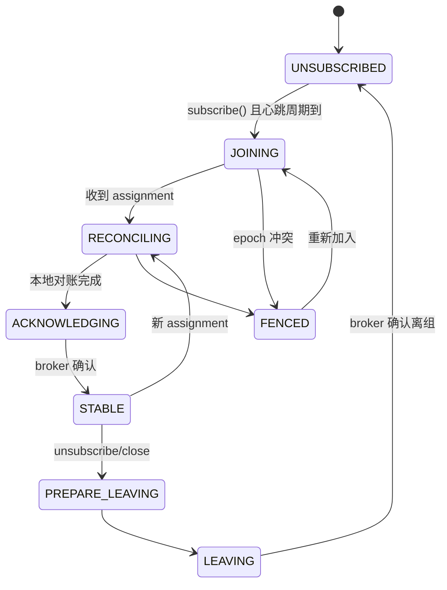

与 classic 的核心差异：

1. **分配算法在 broker 端**（服务端 `group.consumer.assignors`），客户端只上报订阅与 rack；成员通过 `ConsumerGroupHeartbeat` 一个请求完成入组/心跳/接收分配/确认（`ConsumerMembershipManager.java:222-231` 的 `extractAssignment`）。
2. **对账（reconciliation）过程**（`ConsumerMembershipManager.java:87-100` 注释）：解析 topicId → 自动提交 → `onPartitionsRevoked` → `onPartitionsAssigned` → 心跳带 ack 回执。回调仍在应用线程执行（`PartitionsAssignedEvent`/`PartitionsRemovedEvent` 经 `BackgroundEventProcessor` 处理，`AsyncKafkaConsumer.java:237-245`）。
3. **epoch 围栏**：broker 每次分配递增 memberEpoch，旧 epoch 成员的一切请求被拒绝（`FENCED` 状态），杜绝了 classic 协议"脑裂成员"的问题。
4. classic 的 `session.timeout.ms`/`heartbeat.interval.ms` 在此协议**不可配置**（由 broker 控制），消费端不再有独立的"心跳线程"——心跳由后台网络线程顺带完成。

### 14.4 两种协议怎么选

| 场景 | 建议 |
|---|---|
| 已有集群/业务，稳定运行 | 保持 classic（默认） |
| 应用偶发长时间处理消息（&gt;max.poll.interval.ms） | consumer（后台心跳不怕应用卡顿） |
| 想集中管理分配策略（broker 端统一配置） | consumer |
| 需要 sticky/cooperative 等成熟客户端分配算法 | classic |

---

## 15. 完整时序图

一次"从 broker 拉数据到用户拿到 ConsumerRecords"的完整协作（classic 协议）：

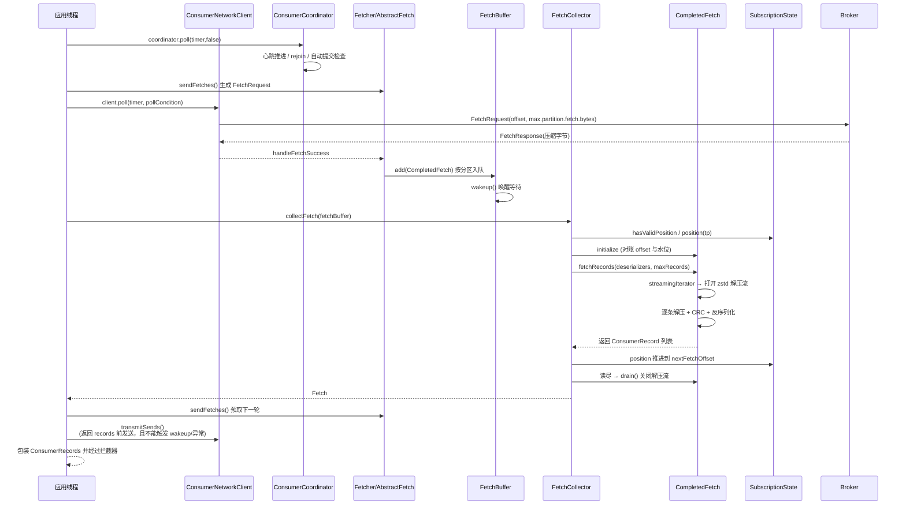

KIP-848 协议下的差异版：

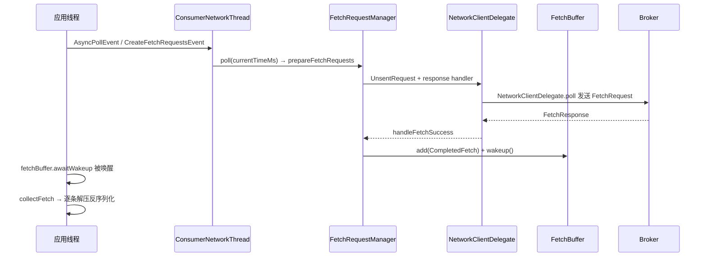

---

## 16. yml 配置详解

### 16.1 Spring Boot application.yml 全量示例

```yaml
spring:
  kafka:
    # ============ 公共配置 ============
    bootstrap-servers: 10.0.0.1:9092,10.0.0.2:9092,10.0.0.3:9092
    client-id: order-service-consumer-01          # 客户端标识（缺省自动生成 consumer-{group}-{n}）

    consumer:
      # ---------- 必填 ----------
      group-id: order-consumer-group               # 消费组（手动 assign 时可不配）
      key-deserializer: org.apache.kafka.common.serialization.StringDeserializer
      value-deserializer: org.apache.kafka.common.serialization.StringDeserializer

      # ---------- 协议选择 ----------
      # group-protocol: consumer                    # 默认 classic；改为 consumer 启用 KIP-848 新协议

      # ---------- 提交 ----------
      enable-auto-commit: false                    # 生产建议 false，手动提交
      auto-commit-interval: 5000                   # 自动提交周期 ms（仅 enable-auto-commit=true 生效）

      # ---------- 位点 ----------
      auto-offset-reset: earliest                  # earliest / latest / by_duration:PnDTnHnMn.nS / none
      # 注意：默认 latest。新消费组若想从历史数据开始必须显式 earliest

      # ---------- 拉取行为 ----------
      fetch-min-size: 1                            # 单次 fetch 最少返回字节（小流量场景调大减少空转）
      fetch-max-wait: 500                          # broker 等 fetch.min.bytes 攒够的最长等待 ms
      max-poll-records: 500                        # 单次 poll 最多返回条数
      max-partition-fetch-bytes: 1048576           # 单分区单次拉取上限（默认 1MB）

      # ---------- 超时与心跳（仅 classic 协议生效） ----------
      session-timeout: 45000                       # 心跳彻底消失多久后 broker 踢人
      heartbeat-interval: 3000                     # 心跳间隔（约 session-timeout 的 1/3）
      max-poll-interval: 300000                    # 两次 poll 间隔上限，超时主动离组

      # ---------- 事务隔离 ----------
      isolation-level: read_uncommitted            # read_committed 只读已提交事务消息

      properties:                                  # 透传原生 Kafka 配置
        request.timeout.ms: 30000                  # 请求等待 broker 响应的上限
        default.api.timeout.ms: 60000              # 所有阻塞 API 的默认超时
        retry.backoff.ms: 100                      # 重试基础退避
        retry.backoff.max.ms: 1000
        reconnect.backoff.ms: 50
        reconnect.backoff.max.ms: 1000
        receive.buffer.bytes: 65536                # socket 接收缓冲
        send.buffer.bytes: 131072                  # socket 发送缓冲
        check.crcs: true                           # 消费时 CRC 校验
        exclude.internal.topics: true              # 正则订阅时排除 __consumer_offsets 等
        allow.auto.create.topics: true             # 订阅不存在的 topic 时允许自动建
        connections.max.idle.ms: 540000            # 空闲连接关闭时间
        metadata.max.age.ms: 300000                # 元数据强制刷新周期
        client.rack: ""                            # 机架感知（配合 broker 副本选择）
        interceptor.classes: ""                    # 消费拦截器类列表
        partition.assignment.strategy: >           # classic 分配策略（按优先级排列）
          org.apache.kafka.clients.consumer.RangeAssignor,
          org.apache.kafka.clients.consumer.CooperativeStickyAssignor
        # group.instance.id: static-member-01      # 静态成员（免 rebalance）
        # group.remote.assignor: uniform            # 仅 consumer 协议：服务端分配器名

    listener:
      type: single                                 # single(默认)/batch/streaming
      ack-mode: manual_immediate                   # manual / manual_immediate / record / batch / count / time
      concurrency: 3                               # 容器并发数（线程数 = 分区数的约数）
      poll-timeout: 3000                           # 容器单次 poll 超时
      max-poll-records: 500                        # 容器级别单次拉取条数（可覆盖上面）
      idle-between-polls: 0                        # 两次 poll 之间休眠 ms（限流用）

# 压缩相关（zstd 专题配套，见第 17 节）：
# 生产端：
# spring.kafka.producer.compression-type: zstd     # 消息用 zstd 压缩
# 消费端无需任何解压配置——解压由客户端自动完成，与压缩类型无关
```

### 16.2 配置项功能与效果详解

以下默认值均来自 `ConsumerConfig.java` 的 `CONFIG` 定义块（421-720 行），与 4.4.0 一致。

#### 位点与提交

| 配置项 | 默认值 | 功能 | 效果与调优 |
|---|---|---|---|
| `enable.auto.commit` | true | 是否周期自动提交 | **生产建议 false**。true 时"处理到一半 crash"也已被提交 → 可能丢消息（至多一次）；false 配手动提交可得至少一次 |
| `auto.commit.interval.ms` | 5000 | 自动提交周期 | 只影响提交频率，不影响拉取。调大减少 broker 写入，但 crash 后重复消费窗口变大 |
| `auto.offset.reset` | latest | 无 committed 时的起始策略 | `latest` 新组只读新数据；`earliest` 从头读；`none` 直接抛异常（数据丢失防护）；`by_duration:PnDTnHnMn.nS` 按时间回退 |
| `group.id` | null | 消费组标识 | null 时只能 assign、不能自动提交（`ConsumerConfig.java:781-792` 会强制关自动提交） |
| `group.instance.id` | null | 静态成员标识 | 配置后成员重启**不触发 rebalance**（会话期内），适合有状态消费者 |

#### 拉取行为

| 配置项 | 默认值 | 功能 | 效果与调优 |
|---|---|---|---|
| `max.poll.records` | 500 | 单次 poll 最多返回条数 | 只影响返回粒度，**不影响底层拉取**（`ConsumerConfig.java:97-99` 注释）。调小降低单批处理时间、增加 poll 频率 |
| `fetch.min.bytes` | 1 | broker 最少攒多少字节才响应 | 调大（如 64KB）→ 减少请求数、提升吞吐，代价是低流量时延迟升高（配合 fetch.max.wait.ms 封顶） |
| `fetch.max.wait.ms` | 500 | broker 攒字节的最长等待 | fetch.min.bytes 攒不够时最多等这么久；调大 → 吞吐升、延迟升 |
| `max.partition.fetch.bytes` | 1048576 (1MB) | 单分区单次拉取上限 | 压缩消息按**压缩后字节**计。大消息（单批 &gt;1MB）仍会被整批返回（保证进度，`ConsumerConfig.java:225-231` 注释）。**调大直接影响消费端内存**：每分区最多 1 批缓冲 + 解压后翻几倍 |
| `fetch.max.bytes` | 52428800 (50MB) | 单次 fetch 响应总上限 | 一次 fetch 覆盖多分区；控制单轮响应内存上限 |
| `check.crcs` | true | 消费时校验 CRC32 | 保数据完整性；追求极致性能可关（不建议） |

#### 心跳与超时（仅 classic）

| 配置项 | 默认值 | 功能 | 效果与调优 |
|---|---|---|---|
| `session.timeout.ms` | 45000 | broker 判定成员死亡的时间 | 内网稳定环境可调小（如 10s）加速故障恢复；网络抖动环境调大防误踢。consumer 协议**不生效** |
| `heartbeat.interval.ms` | 3000 | 心跳发送间隔 | 经验值：≤ session.timeout 的 1/3（`CommonClientConfigs` 校验）。consumer 协议**不生效** |
| `max.poll.interval.ms` | 300000 | 两次 poll 的最大间隔 | **超过 → 应用被主动离组并 rebalance**，常见"消费慢被踢"事故的元凶。单条消息处理慢的批处理业务必须调大；或改用 consumer 协议（后台心跳不受此限） |
| `request.timeout.ms` | 30000 | 单请求等待响应上限 | 超时抛 TimeoutException。不要小于 broker 侧 fetch.max.wait.ms 相关等待 |
| `default.api.timeout.ms` | 60000 | commitSync 等阻塞 API 默认超时 | 覆盖 commitSync(Duration) 等未显式传超时的调用 |

#### 协议与分配

| 配置项 | 默认值 | 功能 | 效果与调优 |
|---|---|---|---|
| `group.protocol` | classic | 组协议选择 | consumer（KIP-848）：服务端分配、后台心跳、抗应用卡顿；两协议的配置互斥约束见 `ConsumerConfig.java:404-419` |
| `partition.assignment.strategy` | Range + CooperativeSticky | classic 分配算法（按优先级） | Sticky 减少迁移；CooperativeSticky 渐进式 rebalance（一次只移一个分区）。**consumer 协议不支持此配置** |
| `group.remote.assignor` | null | consumer 协议的服务端分配器 | 如 `uniform`/`range`（取决于 broker 的 `group.consumer.assignors`）。classic 协议不支持 |

#### 事务与语义

| 配置项 | 默认值 | 功能 | 效果与调优 |
|---|---|---|---|
| `isolation.level` | read_uncommitted | 事务消息可见性 | `read_committed`：只读已提交事务消息，读到 LSO 为止，未决事务阻塞进度（`ConsumerConfig.java:355-361` 注释）；配合生产者事务实现精确一次 |
| `exclude.internal.topics` | true | 正则订阅时排除内部 topic | 显式订阅（非正则）始终可见内部 topic |
| `allow.auto.create.topics` | true | 订阅不存在 topic 时自动建 | 生产建议 false，防止拼写错误静默建错 topic |

#### 资源与网络

| 配置项 | 默认值 | 功能 | 效果与调优 |
|---|---|---|---|
| `receive.buffer.bytes` / `send.buffer.bytes` | 65536 / 131072 | socket 缓冲 | 高吞吐场景可调大到 256KB~1MB |
| `reconnect.backoff.ms` / `reconnect.backoff.max.ms` | 50 / 1000 | 断连重连退避（指数增长） | 网络抖动环境调大 max 减少重连风暴 |
| `retry.backoff.ms` / `retry.backoff.max.ms` | 100 / 1000 | 请求重试退避 | 影响元数据/位点请求的重试节奏 |
| `connections.max.idle.ms` | 540000 (9min) | 空闲连接关闭 | 4.4 有联动校验：classic 下若小于 max.poll.interval.ms 会打 WARN（`ConsumerConfig.java:735-749`） |
| `metadata.max.age.ms` | 300000 (5min) | 元数据强制刷新 | 集群扩分区后最长 5 分钟内感知（有新请求时更早） |
| `client.rack` | "" | 机架标识 | 配合 broker `replica.selector.class` 就近读取（KIP-392） |
| `interceptor.classes` | 空 | 消费拦截器 | 实现 `ConsumerInterceptor`；可做监控埋点、消息过滤 |

#### Spring 容器（spring.kafka.listener.*）

| 配置项 | 默认值 | 功能 | 效果 |
|---|---|---|---|
| `type` | single | 监听容器类型 | `single` 逐条调用监听器；`batch` 按批调用（监听器签名 `List&lt;T&gt;`）；`streaming` 流式 |
| `ack-mode` | （BATCH） | 确认模式 | `manual`/`manual_immediate`：业务代码 `acknowledgment.acknowledge()`；`record`：逐条自动 ack；`batch`：整批自动 ack；`count`/`time`：按条数/时间窗口 ack |
| `concurrency` | 1 | 容器线程数 | 每个线程独立 consumer（同一 group 内多成员）；建议为分区数的约数 |
| `idle-between-polls` | 0 | 两次 poll 间休眠 | 消费限流（注意不要因过长的单条处理触发 max.poll.interval 超时） |

### 16.3 两套常用配置模板

**高吞吐（批处理、可接受秒级延迟）**：

```yaml
spring.kafka.consumer:
  enable-auto-commit: false
  max-poll-records: 1000
  fetch-min-size: 65536        # 64KB 攒批
  fetch-max-wait: 1000
  max-partition-fetch-bytes: 5242880   # 5MB
spring.kafka.listener:
  type: batch
  ack-mode: manual_immediate
```

**低延迟（在线业务，越快越好）**：

```yaml
spring.kafka.consumer:
  enable-auto-commit: false
  max-poll-records: 10
  fetch-min-size: 1
  fetch-max-wait: 50
  max-poll-interval: 600000    # 单条处理可能慢，防误踢
spring.kafka.listener:
  ack-mode: manual_immediate
```

**消费长耗时任务（经典痛点：max.poll.interval.ms 误踢）**：

```yaml
spring.kafka.consumer:
  properties:
    group.protocol: consumer   # KIP-848：后台心跳不受应用卡顿影响
    # 或保持 classic 但：
    # max.poll.interval.ms: 3600000
```

---

## 17. 专题：zstd 解压资源释放与 OOM 修复

> **业务场景**：消息采用 zstd 压缩，消费端运行一段时间后 OOM（进程被杀/容器重启），堆内存曲线正常但 RSS 持续上涨。排查发现源码中解压资源的释放存在问题，需要对源码进行改造来保证释放。
>
> 本节基于本仓库 4.4.0 源码逐条核对资源生命周期，给出**根因分析 + 三种源码级修复方案（含可直接落地的代码）**。

### 17.1 资源全景：zstd 解压到底占用了什么

一次 zstd 解压涉及的资源分三类，**OOM 的主角是第一类**：

| 资源 | 所在位置 | 分配方式 | 释放方式 | 泄漏后果 |
|---|---|---|---|---|
| **ZstdDecompressCtx（native 解压上下文）** | zstd-jni `ZstdInputStreamNoFinalizer` 内部 | JNI → malloc 堆外 | `close()` → `dctx.close()` | **永久泄漏**（GC 无感知），RSS 上涨直至 OOM-kill |
| **解压窗口缓冲（window buffer）** | 同上，按帧头 windowLog 动态扩容 | JNI → malloc 堆外 | 同上 | 同上。Kafka 生产者默认 level=3 → windowLog=23 → **单流最多约 8MB**（windowLog=27 上限 128MB） |
| 16KB 中间缓冲（ChunkedBytesStream） | `BufferSupplier`（heap ByteBuffer） | JVM 堆 | `close()` 还回 supplier / supplier.close() 清空 | 有界（每 consumer 一个 supplier，按需缓存），不会 OOM |
| 压缩字节本身（FetchResponse 原始数据） | `CompletedFetch.partitionData`（heap） | JVM 堆 | drain 后随 CompletedFetch 被 GC | 有界（每分区最多 1 批） |

关键结论：**zstd 的 OOM 是 native 内存泄漏，不是堆泄漏**。堆上对象都会被 GC 回收，但 `ZstdDecompressCtx` 是 malloc 出来的堆外内存，JVM 只负责"何时调用 finalizer/Cleaner"。

### 17.2 为什么 GC 救不了：NoFinalizer 的双刃剑

Kafka 4.4 的解压入口（`ZstdCompression.java:97`）：

```java
return new ZstdInputStreamNoFinalizer(new ByteBufferInputStream(buffer), bufferPool);
```

zstd-jni 库提供两个版本（1.5.6-10，`gradle/dependencies.gradle:139`）：

```java
// zstd-jni 库代码（示意，语义与 1.5.6-10 一致）
public class ZstdInputStream extends FilterInputStream {
    private final ZstdDecompressCtx dctx = new ZstdDecompressCtx();  // native 内存

    @Override
    public void close() throws IOException {
        try {
            super.close();
        } finally {
            dctx.close();          // ← 唯一释放 native 内存的路径
        }
    }

    @Override
    protected void finalize() {    // GC 兜底：对象被回收时释放
        dctx.close();
    }
}

public class ZstdInputStreamNoFinalizer extends ZstdInputStream {
    @Override
    protected void finalize() { }  // ← 兜底被主动移除（finalizer 已废弃、拖慢 GC）
}
```

- 老版 `ZstdInputStream`：即使漏 close()，对象被 GC 时 finalizer 兜底释放 → 泄漏只是"延迟"，最终收敛。
- **`ZstdInputStreamNoFinalizer`：漏 close() = native 内存永久丢失，直到进程退出**。

Kafka 团队选择 NoFinalizer 是对的（finalizer 线程阻塞、GC 延迟等代价不可接受），但前提是**每一条代码路径都必须显式 close**。问题就出在"每一条路径"上。

### 17.3 正常关闭链路（4.4 已修好的部分）

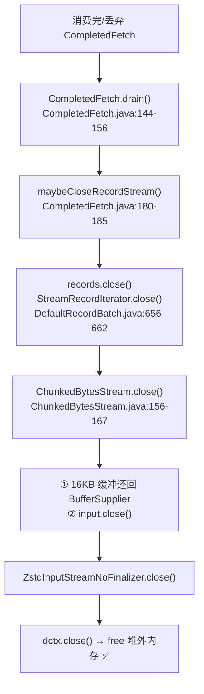

4.4 中 drain 的触发点（[第 9.2 节](#92-fetchrecords--逐条消费--位点推进)已有完整清单）：

1. 整批读尽：`FetchCollector.java:191-193`
2. 分区不再 assigned / 不可 fetchable / 位点不匹配：`FetchCollector.java:214`
3. 订阅变更 / rebalance 回收：`FetchBuffer.retainAll`（`FetchBuffer.java:212-237`）
4. consumer close：`FetchBuffer.close()` → `retainAll(空集合)`（`FetchBuffer.java:262-273`）

### 17.4 泄漏路径分析：哪些路径延迟/漏掉了 drain

#### 路径 A（4.4 仍存在，最值得警惕）：坏消息异常时的"半开流"

```java
// CompletedFetch.java:271-306（fetchRecords 的 try/catch）
try {
    for (int i = 0; i < maxRecords; i++) {
        ...
        lastRecord = nextFetchedRecord(fetchConfig);   // 可能抛 KafkaException（坏批次/坏 CRC）
        ...
        ConsumerRecord<K, V> record = parseRecord(...); // 可能抛 SerializationException
        ...
    }
} catch (SerializationException se) {
    cachedRecordException = se;
    if (records.isEmpty()) throw se;
} catch (KafkaException e) {
    cachedRecordException = e;
    if (records.isEmpty()) throw new KafkaException("...If needed, please seek past the record to continue consumption.", e);
}
return records;
```

**行为**：异常被缓存（`cachedRecordException`），`records` 迭代器**不关闭**，`drain()` 也不调用。设计意图是"用户 seek 越过后继续消费，或重试反序列化"。

**泄漏形态**：只要用户不 seek、不 close consumer，这个分区的解压流**永远打开**。且每次 poll 都重复进入 `fetchRecords` 撞同一条坏消息（275-279 行保证不前进）。如果一个 topic 有 100 个分区、100 条坏消息分布在不同分区，就是 100 个常驻打开的 zstd 流 → **约 800MB native 内存**，且堆上没有任何线索。

**这是"源码中解压缩之后资源释放不好"最典型的现场**。

#### 路径 B（历史版本真实 bug，3.0~3.3 时代最严重）

旧版 Kafka（3.x 早期及更早）消费端拉取逻辑在单个 `Fetcher` 类里（`Fetcher.nextFetchedRecord()`），存在两类已被社区修复的问题：

1. **解析异常不关流**：`nextFetchedRecord` 内 `CorruptRecordException` 抛出时，`records` 迭代器直接随栈帧丢弃，`closeHandlers` 机制尚不存在 → 每条坏消息泄漏一个解压流。
2. **rebalance 清理不关流**：`clearBufferedDataForUnassignedPartitions` 直接从队列移除 `CompletedFetch` 而不关闭其解压迭代器 → **每次 rebalance 泄漏一批**。频繁 rebalance 的集群（常见：频繁发版、扩分区、消费慢触发踢出）会持续累积。

社区后续修复（对应 KAFKA 社区 issue，修复思想一致）：引入 `NextRecord` + closeHandlers（现在的 `CompletedFetch.drain()` 前身），保证所有丢弃路径都关闭解压流。4.4 的 `FetchCollector`/`CompletedFetch` 正是该重构的产物。

#### 路径 C：长时间不 poll 造成的"常驻流"（设计行为，非 bug，但会放大内存占用）

惰性解压意味着：**只要 CompletedFetch 没被读尽且没被 drain，解压流就保持打开**。如果一个消费组长时间不 poll（应用卡顿/处理慢），所有已拉回未读尽的分区流全部常驻。这是有界（每分区 1 个）但**可观**的 native 占用：

```text
常驻 native 内存 ≈ 分区数 × 单流窗口大小（level3 → 约 8MB）
例：64 分区 × 8MB = 512MB 堆外，堆上可能只有几十 MB 缓冲
```

### 17.5 OOM 诊断：怎么确认就是这个泄漏

1. **堆内存正常但 RSS 疯涨**：`jcmd <pid> GC.heap_info` 显示堆占用平稳，`/proc/<pid>/status` 的 VmRSS 持续上涨 → 典型 native 泄漏特征。
2. **开启 NMT 看 malloc 增长**：

```bash
java -XX:NativeMemoryTracking=summary ...   # 启动参数
jcmd <pid> VM.native_memory summary          # 观察 Total / malloc arena 增长
```

3. **`jcmd <pid> VM.native_memory detail` 定位**：zstd-jni 的 malloc 在 `Malloc` 段下（无 JNI 区分时可观察 `- Internal` 增长）。
4. **zstd 特征性确认**——`pmap -x <pid>` 看到大量 8MB 左右的匿名内存块（windowLog=23 的窗口缓冲）可基本实锤。
5. **复现实验**：构造含坏消息（如故意损坏 CRC 的 zstd 批次）的 topic，观察消费端 RSS 阶梯式上涨。

### 17.6 修复方案总览

| 方案 | 改动范围 | 适用场景 | 推荐度 |
|---|---|---|---|
| **方案一：升级** | 无 | 生产还在 3.3 及更早版本 | ★★★ 首选 |
| **方案二：fork 源码补丁** | 修改 Kafka 客户端源码 | 不能升级、需快速止血 | ★★★ 与方案三配合 |
| **方案三：Cleaner 兜底流** | 仅替换一个类 + 修改 ZstdCompression | 任何版本、不想动核心逻辑 | ★★★ 推荐核心方案 |
| **方案四：工程防护** | 无源码改动 | 缓解 + 监控 | ★★ 辅助 |

### 17.7 方案一：升级到修复版本

- 3.4+ 完成 fetch 管线重构（`CompletedFetch.drain()` 保证所有丢弃路径关流）；本仓库 4.4.0 已包含。
- zstd-jni 建议 ≥ 1.5.2-1（Kafka 4.4 用 1.5.6-10）。
- 若生产在 2.x：**直接升 3.4+**（或至少 3.0.2/2.8.2 等包含 fetch 关流修复的补丁版）。升级路径注意 broker 兼容（客户端可先于 broker 升级，KRaft 是 broker 侧的事）。

### 17.8 方案二：fork 源码补丁（针对"坏消息半开流"路径）

**补丁目标**：`CompletedFetch.fetchRecords` 的异常缓存机制与"流保持打开"解耦——**当异常导致整个 fetch 无法继续消费时，仍然保证解压流最终被释放**。

原则：保留"重试反序列化"语义（同一条记录重试不重建流），但当用户明确放弃（seek）或 consumer 关闭时，流必须关闭。4.4 已保证 seek/关闭路径（retainAll 会 drain）。真正缺的是：**持续重试期间给一个可配置的"熔断"选项**——重试 N 次后自动 drain 放弃，避免流无限期常驻。

在 `CompletedFetch.java` 中新增一个可配置的熔断（基于 `ConsumerConfig` 透传自定义配置 `deserialization.retry.max`，不影响 Kafka 默认行为）：

```java
// ============ 补丁 1：CompletedFetch.java ============
// 在类中新增字段（默认 -1 = 不熔断，保持 Kafka 原生行为）：
private int deserializationRetryCount = 0;

/**
 * 业务增强（Kafka 原生无此逻辑）：反序列化/解析异常重试超过阈值时，
 * 主动 drain 本批次并抛出带“seek 建议”的异常，防止 zstd 解压流常驻导致的 native OOM。
 * 该阈值通过自定义配置 deserialization.retry.max 传入（见补丁 2），
 * 默认 -1（不启用，与社区版本行为一致）。
 */
<K, V> List<ConsumerRecord<K, V>> fetchRecords(FetchConfig fetchConfig,
                                               Deserializers<K, V> deserializers,
                                               int maxRecords) {
    if (corruptLastRecord)
        throw new KafkaException("Received exception when fetching the next record from " + partition
                + ". If needed, please seek past the record to continue consumption.", cachedRecordException);

    if (isConsumed)
        return Collections.emptyList();

    List<ConsumerRecord<K, V>> records = new ArrayList<>();
    try {
        for (int i = 0; i < maxRecords; i++) {
            if (cachedRecordException == null) {
                corruptLastRecord = true;
                lastRecord = nextFetchedRecord(fetchConfig);
                corruptLastRecord = false;
            }
            if (lastRecord == null) break;
            Optional<Integer> leaderEpoch = maybeLeaderEpoch(currentBatch.partitionLeaderEpoch());
            TimestampType timestampType = currentBatch.timestampType();
            ConsumerRecord<K, V> record = parseRecord(deserializers, partition, leaderEpoch, timestampType, lastRecord);
            records.add(record);
            recordsRead++;
            bytesRead += lastRecord.sizeInBytes();
            nextFetchOffset = lastRecord.offset() + 1;
            cachedRecordException = null;
            deserializationRetryCount = 0;      // ← 新增：成功即清零
        }
    } catch (SerializationException se) {
        cachedRecordException = se;
        if (records.isEmpty()) {
            if (maybeTriggerDeserializationCircuitBreaker(se))  // ← 新增：熔断检查
                throw new KafkaException("Deserialization retry limit exceeded for partition " + partition
                        + "; the fetch has been drained to release decompression resources. "
                        + "Please seek past offset " + nextFetchOffset + " to continue consumption.", se);
            throw se;
        }
    } catch (KafkaException e) {
        cachedRecordException = e;
        if (records.isEmpty()) {
            if (maybeTriggerDeserializationCircuitBreaker(e))  // ← 新增：熔断检查
                throw new KafkaException("Record parsing retry limit exceeded for partition " + partition
                        + "; the fetch has been drained to release decompression resources. "
                        + "Please seek past offset " + nextFetchOffset + " to continue consumption.", e);
            throw new KafkaException("Received exception when fetching the next record from " + partition
                    + ". If needed, please seek past the record to continue consumption.", e);
        }
    }
    return records;
}

/**
 * 业务增强：异常重试计数达到阈值时 drain（关闭 zstd 解压流），
 * 让 native 内存立即归还，而不是让流常驻等待用户 seek。
 *
 * @return true 表示已熔断并 drain，调用方应抛出异常
 */
private boolean maybeTriggerDeserializationCircuitBreaker(Exception cause) {
    if (deserializationRetryMax <= 0) {
        return false;                     // 未启用熔断 → 保持 Kafka 原生行为
    }
    if (++deserializationRetryCount >= deserializationRetryMax) {
        log.warn("Deserialization retry limit ({}) exceeded for partition {}; "
                        + "draining fetch to release decompression (zstd) resources. Cause: {}",
                deserializationRetryMax, partition, cause.getMessage());
        drain();                          // ← 关键：关闭解压流，释放 native 内存
        return true;
    }
    return false;
}
```

注意：**熔断触发后用户必须 seek** 才能继续消费该分区（否则 `position` 停在坏消息处，下一轮拉取会重新拉回同样数据——这正是 Kafka 的语义，只是现在流不会常驻了）。同时 `drain()` 会执行 `recordAggregatedMetrics`，指标上可见。

### 17.9 方案三：Cleaner 兜底流（核心推荐方案）

**思路**：不动消费链路，只在最底层给解压流加一道 **GC 兜底保险**——即使上层任何路径漏掉 close()，对象被 GC 回收时 `Cleaner` 也会释放 native 内存。`Cleaner` 是 JDK 9+ 对 finalizer 的官方替代（不拖慢 GC、无 finalizer 线程），正好补上 `ZstdInputStreamNoFinalizer` 移除的兜底。

```java
// ============ 补丁 2：新增 ZstdAutoReleaseInputStream.java ============
// 位置建议：clients/src/main/java/org/apache/kafka/common/compress/ZstdAutoReleaseInputStream.java
package org.apache.kafka.common.compress;

import java.io.FilterInputStream;
import java.io.IOException;
import java.io.InputStream;
import java.lang.ref.Cleaner;
import java.util.concurrent.atomic.AtomicBoolean;

/**
 * 带 Cleaner 兜底的 zstd 解压流。
 *
 * <p>背景：Kafka 使用 zstd-jni 的 {@code ZstdInputStreamNoFinalizer}（ZstdCompression.java:97），
 * 该流内部持有 native 的 ZstdDecompressCtx（堆外内存，单流可达数 MB~128MB）。
 * NoFinalizer 版本移除了 GC 兜底，一旦上层路径漏 close()，native 内存永久泄漏直至进程退出。
 *
 * <p>本类在不改变解压语义的前提下补回兜底：显式 close() 是主路径（正常时立即释放），
 * Cleaner 是保险（对象被 GC 回收时兜底释放），且重复释放被幂等保护。
 *
 * <p>性能说明：Cleaner 注册每个实例一个对象（约几十字节堆开销），
 * 相比 native 泄漏风险可忽略；Cleaner 线程只在 GC 回收时运行。
 */
public class ZstdAutoReleaseInputStream extends FilterInputStream {

    /** 全局共享一个 Cleaner（内部自带守护线程，无 finalizer 的 GC 延迟问题） */
    private static final Cleaner CLEANER = Cleaner.create();

    /** 幂等释放保护：显式 close 与 Cleaner 兜底竞争时只释放一次 */
    private final AtomicBoolean released = new AtomicBoolean(false);

    /** 绑定到 this 的清理动作；clean() 可重复调用，动作只执行一次 */
    private final Cleaner.Cleanable cleanable;

    public ZstdAutoReleaseInputStream(InputStream delegate) {
        super(delegate);
        this.cleanable = CLEANER.register(this, new ReleaseNativeResources(delegate));
    }

    /**
     * 显式关闭：先释放 native 资源，再关闭底层流。
     * 这是主路径——正常消费流程都会走到这里。
     */
    @Override
    public void close() throws IOException {
        if (released.compareAndSet(false, true)) {
            cleanable.clean();          // 执行一次释放动作并注销 Cleaner
        }
        super.close();                  // 关闭底层 ZstdInputStream（幂等，二次 close 无害）
    }

    /**
     * Cleaner 兜底动作：this 被 GC 判定为不可达时由 Cleaner 线程执行。
     * 若上层已经显式 close()，released 已置位，此处跳过（幂等）。
     */
    private static final class ReleaseNativeResources implements Runnable {
        private final InputStream delegate;

        ReleaseNativeResources(InputStream delegate) {
            this.delegate = delegate;
        }

        @Override
        public void run() {
            try {
                delegate.close();       // → ZstdInputStreamNoFinalizer.close() → dctx.close() 释放 native
            } catch (IOException ignored) {
                // GC 兜底阶段无法上报异常，也不应中断 Cleaner 线程
            }
        }
    }
}
```

**替换接入点**（修改 `ZstdCompression.java:66-75`，只改一行）：

```java
// ============ 补丁 3：ZstdCompression.java 的 wrapForInput ============
@Override
public InputStream wrapForInput(ByteBuffer buffer, byte messageVersion, BufferSupplier decompressionBufferSupplier) {
    try {
        return new ChunkedBytesStream(
                wrapForZstdInput(buffer, decompressionBufferSupplier),
                decompressionBufferSupplier,
                decompressionOutputSize(),
                false);
    } catch (Throwable e) {
        throw new KafkaException(e);
    }
}

// 修改 wrapForZstdInput 的返回包装（ZstdCompression.java:78-98）：
// 将
//   return new ZstdInputStreamNoFinalizer(new ByteBufferInputStream(buffer), bufferPool);
// 替换为
//   return new ZstdAutoReleaseInputStream(
//           new ZstdInputStreamNoFinalizer(new ByteBufferInputStream(buffer), bufferPool));
```

**为什么这样改是安全的**：

1. **不改变正常路径**：正常消费流程的 close 链（drain → StreamRecordIterator.close → ChunkedBytesStream.close → 本类 close）一步不少，资源照常立即释放。
2. **兜底只覆盖对象不可达后的异常路径**：只有"漏 close 且已经没有强引用"的对象才会走到 Cleaner；正常对象被 close 后 `released=true` 且 Cleaner 已注销，零额外开销。
3. **幂等**：`AtomicBoolean` 保证显式 close 与 Cleaner 竞争时 native 释放只发生一次（zstd-jni 的 `dctx.close()` 本身也幂等，双保险）。
4. **线程安全**：Cleaner 线程与消费线程并发 close 的场景被 CAS 正确序列化。

**效果**：路径 A（坏消息半开流）、路径 B（rebalance 丢弃）、任何未知路径中"对象已经不可达但漏 close"的泄漏都退化为"**延迟释放**"——最坏情况是 GC 后才释放。仍被 `FetchBuffer` / `CompletedFetch` 强引用的半开流不属于 Cleaner 可处理范围，必须依赖继续消费、`drain()`、`retainAll()` 或 `close()` 释放。

### 17.10 补丁配套：验证与测试

**单元测试**（`ZstdAutoReleaseInputStreamTest`，JUnit 5）：

```java
package org.apache.kafka.common.compress;

import com.github.luben.zstd.ZstdInputStreamNoFinalizer;
import org.apache.kafka.common.utils.internals.BufferSupplier;
import org.apache.kafka.common.utils.internals.ByteBufferInputStream;
import org.junit.jupiter.api.Test;

import java.io.IOException;
import java.nio.ByteBuffer;
import java.nio.charset.StandardCharsets;

import static org.junit.jupiter.api.Assertions.assertDoesNotThrow;
import static org.junit.jupiter.api.Assertions.assertEquals;
import static org.junit.jupiter.api.Assertions.assertThrows;

class ZstdAutoReleaseInputStreamTest {

    /** 显式 close 后正常读取结束、二次 close 幂等 */
    @Test
    void testExplicitCloseIsIdempotent() throws IOException {
        ZstdAutoReleaseInputStream stream = streamFor("hello-zstd");
        byte[] buf = new byte[64];
        int n = stream.read(buf);                 // 正常读
        assertDoesNotThrow(stream::close);        // 第一次 close
        assertDoesNotThrow(stream::close);        // 第二次 close 幂等，不抛异常
    }

    /** close 后再读应抛 Stream closed（与底层语义一致） */
    @Test
    void testReadAfterCloseThrows() throws IOException {
        ZstdAutoReleaseInputStream stream = streamFor("after-close");
        stream.close();
        assertThrows(IOException.class, () -> stream.read(new byte[8]));
    }

    /** 模拟漏 close：只留弱引用，触发 GC 后 Cleaner 兜底释放（不抛异常） */
    @Test
    void testCleanerFallbackReleasesResources() throws Exception {
        // 用 WeakReference 保证对象可被回收
        java.lang.ref.WeakReference<ZstdAutoReleaseInputStream> ref =
                new java.lang.ref.WeakReference<>(streamFor("gc-fallback"));

        // 模拟上层代码路径漏掉 close()
        System.gc();
        for (int i = 0; i < 50 && ref.get() != null; i++) {
            System.gc();
            Thread.sleep(100);
        }
        // 对象已被回收，Cleaner 动作已执行（无异常即通过；native 释放可用 NMT 复核）
    }

    private ZstdAutoReleaseInputStream streamFor(String content) throws IOException {
        // 复用 ZstdCompression.wrapForZstdInput 的构造方式（测试走生产同款组装）
        byte[] compressed = ZstdCompressionTestUtils.compress(content.getBytes(StandardCharsets.UTF_8));
        ZstdInputStreamNoFinalizer zstd = new ZstdInputStreamNoFinalizer(
                new ByteBufferInputStream(ByteBuffer.wrap(compressed)), BufferSupplier.NO_CACHING::get);
        return new ZstdAutoReleaseInputStream(zstd);
    }
}
```

**压测验证脚本**（确认 native 内存不再增长）：

```bash
# 1. 启动消费进程（带 NMT）
java -XX:NativeMemoryTracking=summary -Xmx512m -jar your-app.jar

# 2. 连续注入含坏消息的 zstd 批次（模拟路径 A 的泄漏场景）
#    使用 kafka-producer-perf-test 或自定义工具向 topic 写入：
#    - 正常 zstd 压缩消息（走正常 close 路径）
#    - 故意损坏 CRC 的消息（触发 fetchRecords 异常路径）

# 3. 观察 native 内存（修复前：持续上涨；修复后：稳定）
watch -n 5 'jcmd <pid> VM.native_memory summary | grep -A2 Total'

# 4. 观察 RSS（修复前：阶梯上涨至 OOM；修复后：随 GC 波动回归）
ps -o rss= -p <pid>
```

### 17.11 方案四：不改源码的工程防护

1. **限制 native 内存总量**（防 OOM-kill 拖垮整机）：

```bash
-XX:MaxDirectMemorySize=1g      # 限制直接内存（注意：zstd 的 malloc 不走 DirectByteBuffer，此项只兜底别的）
# native malloc 无法用 JVM 参数硬限制 → 用容器限制：
#   docker --memory=2g --memory-swap=0   （超过即 OOM-kill 容器，但至少不拖垮宿主机）
```

2. **监控告警**：对 RSS/堆内存比值设阈值（如 RSS &gt; 1.5×Xmx 持续 10 分钟即告警）。
3. **坏消息治理**：生产上"坏消息"是根本诱因——开启 `check.crcs=true`（默认开）尽早发现；业务上对反序列化异常做 seek 跳过策略；监控 `CorruptRecordException`/`RecordDeserializationException` 日志量。
4. **消费不 lag 的纪律**：`max.poll.interval.ms` 内必须 poll；长耗时处理用 KIP-848 协议或异步处理 + 及时 poll 排空缓冲。
5. **周期性重启**（临时止血）：若泄漏版本无法立即升级，根据泄漏速率安排滚动重启（K8s 下可配 `livenessProbe` 内存阈值触发重建）。

### 17.12 本节小结

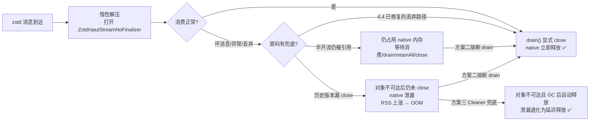

**落地建议**：

1. 生产还在旧版本 → **先升级**（方案一），收益最大。
2. 无法升级/需要双保险 → **方案三（Cleaner 兜底流）**，改动最小、风险最低，作为长期防线。
3. 坏消息治理 → **方案二（熔断）**，让问题显性化而不是静默堆积。
4. 所有场景 → **方案四的监控**，RSS 阈值告警防患未然。

---

## 18. 附录：关键类速查表

| 类 | 位置 | 职责 |
|---|---|---|
| `KafkaConsumer` | `clients/consumer/KafkaConsumer.java` | 统一门面，按 group.protocol 分发实现（543 行） |
| `ClassicKafkaConsumer` | `clients/consumer/internals/ClassicKafkaConsumer.java` | classic 协议实现，poll 主循环（641-689 行） |
| `AsyncKafkaConsumer` | `clients/consumer/internals/AsyncKafkaConsumer.java` | KIP-848 实现，poll 主循环（933-982 行） |
| `ConsumerNetworkClient` | `clients/consumer/internals/ConsumerNetworkClient.java` | classic 网络门面，poll 推进 IO（262-317 行） |
| `ConsumerNetworkThread` | `clients/consumer/internals/ConsumerNetworkThread.java` | KIP-848 后台网络线程，runOnce（210-242 行） |
| `ConsumerCoordinator` | `clients/consumer/internals/ConsumerCoordinator.java` | classic 组协调：rejoin/心跳/自动提交（513-591 行） |
| `ConsumerMembershipManager` | `clients/consumer/internals/ConsumerMembershipManager.java` | KIP-848 成员管理（ConsumerGroupHeartbeat） |
| `AbstractMembershipManager` | `clients/consumer/internals/AbstractMembershipManager.java` | 成员状态机（234-250 行 transitionTo） |
| `AbstractFetch` | `clients/consumer/internals/AbstractFetch.java` | 拉取抽象：发请求（421-488 行）、收响应（151-257 行） |
| `Fetcher` | `clients/consumer/internals/Fetcher.java` | classic 拉取实现（collectFetch，145 行） |
| `FetchRequestManager` | `clients/consumer/internals/FetchRequestManager.java` | KIP-848 拉取 RequestManager（poll，103 行） |
| `FetchBuffer` | `clients/consumer/internals/FetchBuffer.java` | 线程安全缓冲队列；retainAll 清理（212-237 行） |
| `FetchCollector` | `clients/consumer/internals/FetchCollector.java` | 收集编排：initialize + fetchRecords + drain（91-217 行） |
| `CompletedFetch` | `clients/consumer/internals/CompletedFetch.java` | 单分区批次：惰性解压（187-244 行）、反序列化（257-307 行）、drain（144-156 行） |
| `Fetch` | `clients/consumer/internals/Fetch.java` | poll 返回值容器（records + nextOffsets） |
| `SubscriptionState` | `clients/consumer/internals/SubscriptionState.java` | 位点状态机（TopicPartitionState，1011-1260 行） |
| `CommitRequestManager` | `clients/consumer/internals/CommitRequestManager.java` | KIP-848 提交管理（自动提交 277-320 行） |
| `ConsumerConfig` | `clients/consumer/ConsumerConfig.java` | 全部配置定义与默认值（421-720 行） |
| `CompressionType` | `common/record/internal/CompressionType.java` | 压缩枚举（ZSTD，99-130 行） |
| `ZstdCompression` | `common/compress/ZstdCompression.java` | zstd 工厂：wrapForInput（66-98 行） |
| `ChunkedBytesStream` | `common/utils/internals/ChunkedBytesStream.java` | 池化缓冲流，close 释放缓冲+关底层流（156-167 行） |
| `DefaultRecordBatch` | `common/record/internal/DefaultRecordBatch.java` | 批次解析：streamingIterator（359-364 行）、StreamRecordIterator.close（656-662 行） |
| `BufferSupplier` | `common/utils/internals/BufferSupplier.java` | 解压缓冲池（DefaultSupplier 66-91 行） |
| `CloseableIterator` | `common/utils/internals/CloseableIterator.java` | 需显式 close 的迭代器契约（28 行） |

---

> 文档结束。生产者链路请见同目录《KafkaProducer发送链路源码解析.md》。
