# Kafka Producer 发送链路源码解析

> 源码位置：`kafka/clients/src/main/java/org/apache/kafka/clients/producer/`
> 核心类：`KafkaProducer`、`RecordAccumulator`、`Sender`、`ProducerBatch`、`NetworkClient`、`Metadata`
> 本文配套注释：`RecordAccumulator.java`（append/ready/partitionReady/batchReady/drain）与 `Sender.java`（run/runOnce/sendProducerData 等）均已补齐中文注释，可对照阅读。

---

## 目录

1. [总体架构：两个线程的协作模型](#1-总体架构两个线程的协作模型)
2. [核心结论：一个 Producer 与集群的关系](#2-核心结论一个-producer-与集群的关系)
3. [KafkaProducer#send → doSend 详解](#3-kafkaproducersend--dosend-详解)
4. [waitOnMetadata：元数据等待](#4-waitonmetadata元数据等待)
5. [分区选择 partition()：四级优先级](#5-分区选择-partition四级优先级)
6. [RecordAccumulator#append：攒批入队](#6-recordaccumulatorappend攒批入队)
7. [ready 判定：ready → partitionReady → batchReady](#7-ready-判定ready--partitionready--batchready)
8. [drain：按 broker 摘批次](#8-drain按-broker-摘批次)
9. [Sender#run 生命周期](#9-senderrun-生命周期)
10. [runOnce 与 sendProducerData](#10-runonce-与-sendproducerdata)
11. [sendProduceRequest：构造请求](#11-sendproducerequest构造请求)
12. [handleProduceResponse → completeBatch：响应处理](#12-handleproduceresponse--completebatch响应处理)
13. [一条消息的一生：完整时序](#13-一条消息的一生完整时序)
14. [保序机制专题](#14-保序机制专题)
15. [超时体系专题](#15-超时体系专题)
16. [幂等与事务简述](#16-幂等与事务简述)
17. [元数据机制专题](#17-元数据机制专题)
18. [多集群 × 多 Topic × 多 Partition 工程实践](#18-多集群--多-topic--多-partition-工程实践)
19. [关键配置速查表](#19-关键配置速查表)
20. [核心方法索引](#20-核心方法索引)

---

## 1. 总体架构：两个线程的协作模型

Kafka Producer 客户端采用**用户线程 + Sender 后台线程**的双线程解耦模型：

- **用户线程**：调用 `send()`，只做"序列化 → 选分区 → 攒批入队"，**绝不碰网络**；
- **Sender 线程**：唯一网络出口，循环执行"判定 ready → drain → 构造请求 → poll 驱动 I/O → 处理响应"。

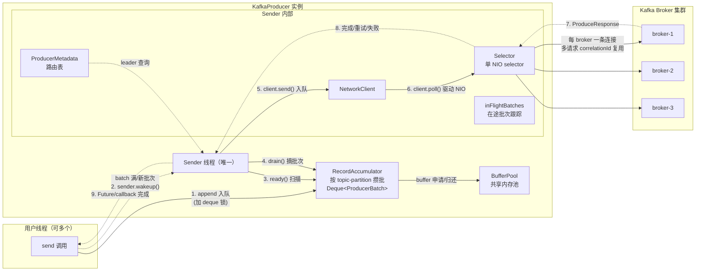

关键理解点：

1. **"发送"不是同步 socket 写**：`client.send()` 只是把请求交给 NetworkClient 队列，真正的读写由 `client.poll()` 里的 NIO Selector 驱动；
2. **run() 只在线程启动时进入一次**：里面是 `while` 循环反复执行 `runOnce()`；`sender.wakeup()` 不是重新执行 run()，而是打断 `client.poll(timeout)` 的阻塞，让 Sender 提前进入下一轮；
3. **锁粒度**：每个 topic-partition 一个 deque 锁（`synchronized (deque)`），用户线程 append 与 Sender 线程 drain 只在各自操作队尾/队头时短暂加锁。

---

## 2. 核心结论：一个 Producer 与集群的关系

- **一个 KafkaProducer 实例只连接一个 Kafka 集群**（由 `bootstrap.servers` 决定），内部**只有一个 Sender 线程**；
- 客户端没有"切换集群"的能力——**"切换集群" = 换一个 Producer 实例**；
- `bootstrap.servers` 里配 5 个地址**不等于 5 个集群**：如果这 5 个地址是同一集群的 broker，客户端只用它们"第一次敲门"，随后从元数据拿到该集群全部 broker 并连接；如果是 5 个互相独立的真集群，就必须建 5 个 Producer；
- Sender 线程创建时机：`KafkaProducer` 构造函数（KafkaProducer.java:497-500）——`new Sender(...)` → `new SenderThread(ioThreadName, sender, /*daemon*/ true)` → `ioThread.start()`，线程名 `kafka-producer-network-thread | <clientId>`，daemon 线程。

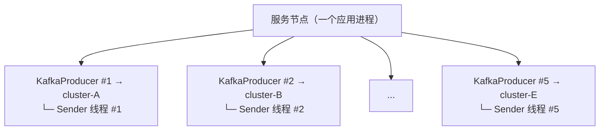

---

## 3. KafkaProducer#send → doSend 详解

### 3.1 send 入口（KafkaProducer.java:1115）

```java
public Future<RecordMetadata> send(ProducerRecord<K, V> record, Callback callback) {
    ProducerRecord<K, V> interceptedRecord = this.interceptors.onSend(record); // ① 拦截器链
    return doSend(interceptedRecord, callback);                                // ② 核心实现
}
```

- 拦截器（ProducerInterceptor#onSend）可能返回被修改过的 ProducerRecord，后续一律使用新 record；
- 拦截器异常不会向外抛出（ProducerInterceptors 内部捕获）；
- `send` 的语义：**异步**，record 放入本地缓冲区后立即返回 Future；真正网络发送由 Sender 完成。

### 3.2 doSend 九阶段（KafkaProducer.java:1163）

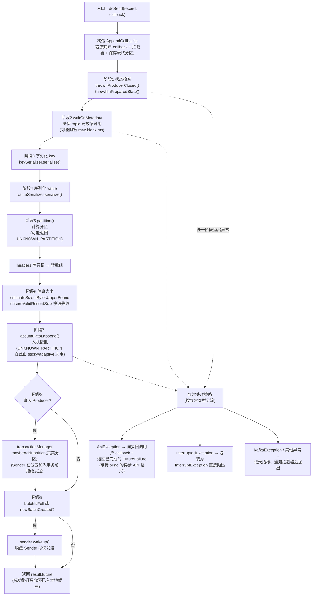

各阶段说明：

| 阶段 | 代码位置 | 说明 |
|---|---|---|
| 1. 状态检查 | KafkaProducer.java:1174-1175 | Producer 已关闭 → `IllegalStateException`；事务处于 prepared（2PC 决议窗口）→ 禁止再发送 |
| 2. 元数据等待 | KafkaProducer.java:1180-1196 | 见 [第 4 节](#4-waitonmetadata元数据等待)；等待耗时从 maxBlockTimeMs 中扣除，剩余时间传给 append 用于 buffer 分配等待 |
| 3-4. 序列化 | KafkaProducer.java:1198-1218 | key/value 通过配置的 Serializer 转 byte[]；`ClassCastException` 转成更明确的 `SerializationException` |
| 5. 分区计算 | KafkaProducer.java:1226 | 见 [第 5 节](#5-分区选择-partition四级优先级)；可能返回 `UNKNOWN_PARTITION` |
| 6. 大小估算 | KafkaProducer.java:1233-1238 | `AbstractRecords.estimateSizeInBytesUpperBound` 估算**上界**（真实压缩效果要到 batch 关闭时才知道）；超过 max.request.size 直接失败，不让超大消息进 accumulator |
| 7. 入队 | KafkaProducer.java:1247-1250 | `accumulator.append(...)`；append 后断言真实分区已确定（sticky 分区器已在内部选定） |
| 8. 事务登记 | KafkaProducer.java:1259-1261 | 事务 Producer 把分区加入事务；必须在 append 后做，因为 append 前分区可能未知；**Sender 会拒绝发送未加入事务的分区批次** |
| 9. 唤醒 Sender | KafkaProducer.java:1263-1268 | batch 满或新建 batch 时 `sender.wakeup()`；不唤醒也会被 poll 超时/linger 推进，但延迟更高 |

### 3.3 异常处理策略（KafkaProducer.java:1280-1315）

```text
send 链路异常
│
├─ ApiException（协议/API 层可归类异常）
│     ├─ 同步调用用户 callback.onCompletion(nullMetadata, e)   ← 保证 callback 一定被触发
│     ├─ interceptors.onSendError(...)
│     ├─ transactionManager.maybeTransitionToErrorState(e)    ← 事务可能进入 fatal/abortable
│     └─ 返回 new FutureFailure(e)                            ← get() 必抛 ExecutionException
│
├─ InterruptedException → 抛 InterruptException（Kafka 公共异常）
└─ KafkaException / 其他 → 记录指标 + 通知拦截器 + 原样抛出
```

注意：`ApiException` 走"失败 Future"路径是为了维持 send 的**异步 API 语义**——调用方拿到的 Future 已经是完成态（失败态），而拦截器/事务错误状态也不会被遗漏。

---

## 4. waitOnMetadata：元数据等待

方法位置：KafkaProducer.java:1338。

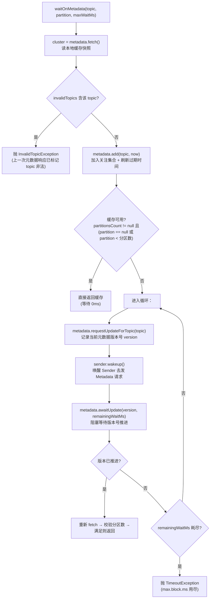

要点：

1. **版本号等待机制**：`requestUpdateForTopic` 返回当前版本号，`awaitUpdate(version, ...)` 阻塞到元数据版本 > version（即 Sender 拉回了新元数据）；
2. **唤醒 Sender**：元数据请求由 Sender 线程发送（发往 `leastLoadedNode`），所以这里必须 `sender.wakeup()`，否则 Sender 可能在 poll 里沉睡；
3. **阻塞上限**：`max.block.ms`（默认 60s），且**和 buffer 分配共享预算**——doSend 里 `remainingWaitMs = maxBlockTimeMs - waitedOnMetadataMs`；
4. **典型阻塞场景**：topic 刚创建、分区刚扩容（本地缓存分区数过旧）、集群不可达；
5. **降低首条延迟**：提前调用 `partitionsFor(topic)` 预加载元数据；但注意 `metadata.max.idle.ms`（默认 5min）后空闲 topic 的缓存会被清理，长时间空闲后的首条发送仍会经历等待。

---

## 5. 分区选择 partition()：四级优先级

方法位置：KafkaProducer.java:1742。

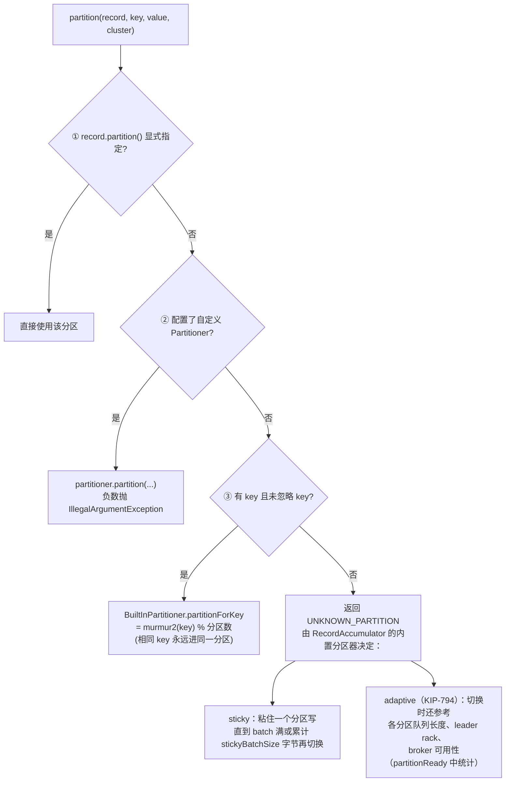

- **sticky 分区的并发竞态**：多线程 append 时分区可能被其他线程切换，`RecordAccumulator.append` 里通过 `partitionChanged()` 校验并重试（外层 `while(true)` 循环）；
- **sticky 切换抑制**：队列中还有未满 batch 时暂缓切换（`enableSwitch = allBatchesFull(dq)`），保证批聚效果。

---

## 6. RecordAccumulator#append：攒批入队

方法位置：RecordAccumulator.java:307。

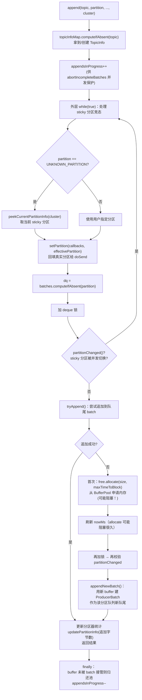

三个关键设计：

1. **"先试再分配"**：`tryAppend` 失败才去 BufferPool 申请新 buffer——最大化批次复用，减少内存分配；
2. **单条大消息**：`size = max(batch.size, 单条消息估算上界)`——消息大于 batch.size 时按消息大小申请（超 max.request.size 已在 doSend 拦截）；
3. **buffer 分配可能阻塞**：BufferPool 耗尽时 `allocate` 阻塞，受 doSend 传入的 `remainingWaitMs`（剩余 max.block.ms）约束。这也是 Sender 侧 `exhausted`（`free.queued() > 0`）判定"所有批次立即 ready"的原因——**不发出去，排队线程永远拿不到内存**。

### 6.1 tryAppend（RecordAccumulator.java:520）

```text
dq.peekLast() → 队尾 batch
│
├─ null（队列空）→ 返回 null，调用方建新批次
├─ last.tryAppend(...) 返回 null（空间不足）
│     └─ last.closeForRecordAppends()   ← 关闭追加，释放压缩 buffer 等追加期资源
│         返回 null，调用方建新批次
└─ 追加成功
      └─ 返回 RecordAppendResult(future, batchIsFull, newBatchCreated=false, 本次追加字节数)
```

**只往队尾追加**是保序的关键：队头批次可能已 ready/在途，绝不允许新消息插到它前面。

### 6.2 BufferPool 内存模型

```text
buffer.memory = 32MB（默认，全局共享，所有 topic/partition 一起用）
├─ 每次申请：batch.size = 16KB（默认）的 ByteBuffer
├─ 申请不到：进入条件等待队列（用户线程阻塞，受 max.block.ms 限制）
├─ 归还：batch 完成（成功/失败）→ deallocate → 回池复用
└─ waiting-threads / buffer-total-bytes / buffer-available-bytes 三个指标可观测
```

---

## 7. ready 判定：ready → partitionReady → batchReady

### 7.1 ready 总览（RecordAccumulator.java:933）

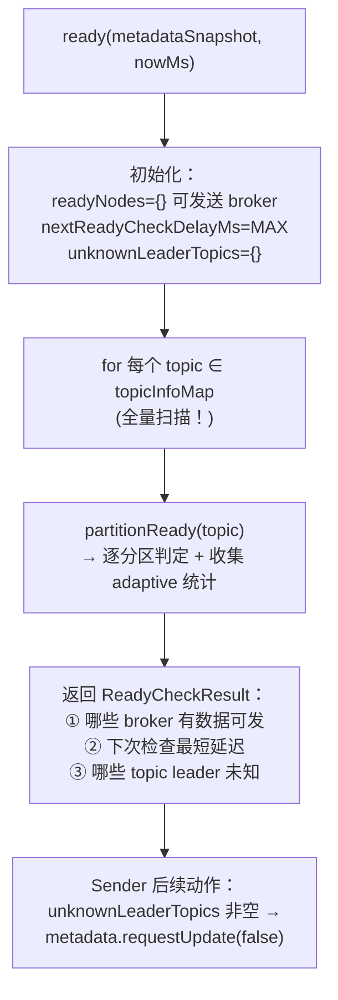

### 7.2 partitionReady 逐分区处理（RecordAccumulator.java:785）

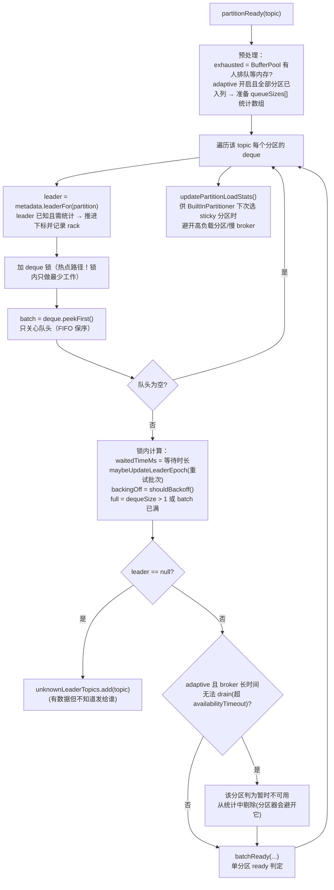

**热点路径优化（KAFKA-16226）**：分区数很大时这段循环极热——
1. 避免增加用户线程与 Sender 线程的锁竞争；
2. deque 锁同时被 append 线程使用，锁内只做最少必要工作（等待时长/退避/full 全部锁内算好，锁外才做判定）；
3. 队列经常为空，`peekFirst() == null` 立即 continue，减少锁内停留。

### 7.3 batchReady 决策树（RecordAccumulator.java:723）

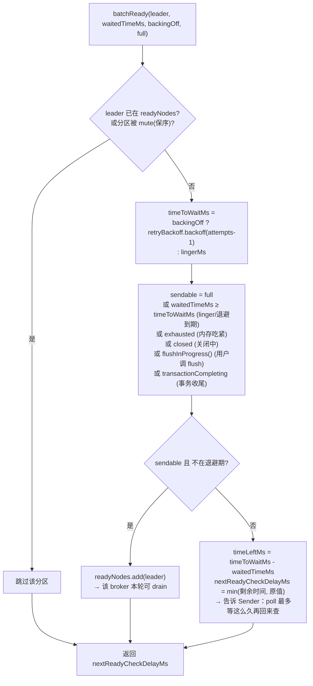

**nextReadyCheckDelayMs 的联动**：它一路返回给 `sendProducerData`，成为 `client.poll(pollTimeout)` 的等待上限——Sender **不是自旋轮询**，而是"睡到下一个批次最可能 ready 的时刻"。

---

## 8. drain：按 broker 摘批次

方法位置：`drain` RecordAccumulator.java:1158，`drainBatchesForOneNode` RecordAccumulator.java:1030。

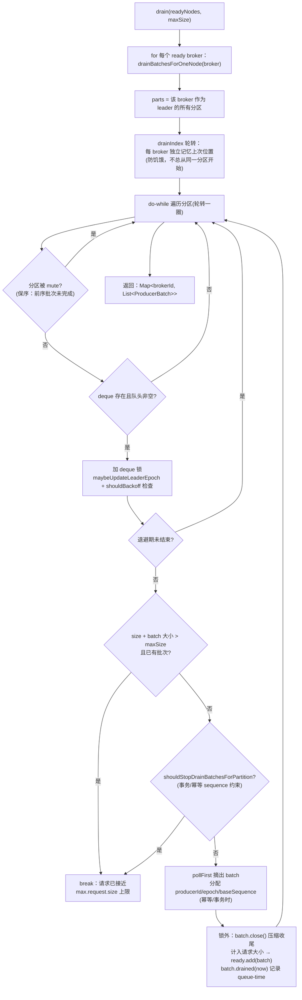

关键细节：

1. **轮转防饥饿**：`nodesDrainIndex` 每 broker 独立记忆，同一 broker 下多个 leader 分区轮转 drain，避免总从固定分区开始；
2. **一个分区一次只摘一个 batch**（`pollFirst`）：队头批次没发完，同分区后续批次不能发，保证 FIFO；
3. **mute 分区跳过**：`guaranteeMessageOrder`（max.in.flight=1）模式下，已 drain 的分区被 mute，前序批次完成后才 unmute；
4. **sequence 分配在 drain 时完成**（幂等/事务）：`batch.setProducerState(producerIdAndEpoch, sequenceNumber, isTransactional)` + `incrementSequenceNumber` + `addInFlightBatch`，响应乱序回来也能按 sequence 校验顺序；
5. **单批超限的兜底**：极少数情况下单 batch 压缩后仍超 maxSize，会单独作为"超限请求"发送（不会死循环）；
6. **close 在锁外做**：`batch.close()` 含压缩等重操作，放锁外避免阻塞 append 线程。

---

## 9. Sender#run 生命周期

方法位置：Sender.java:276。

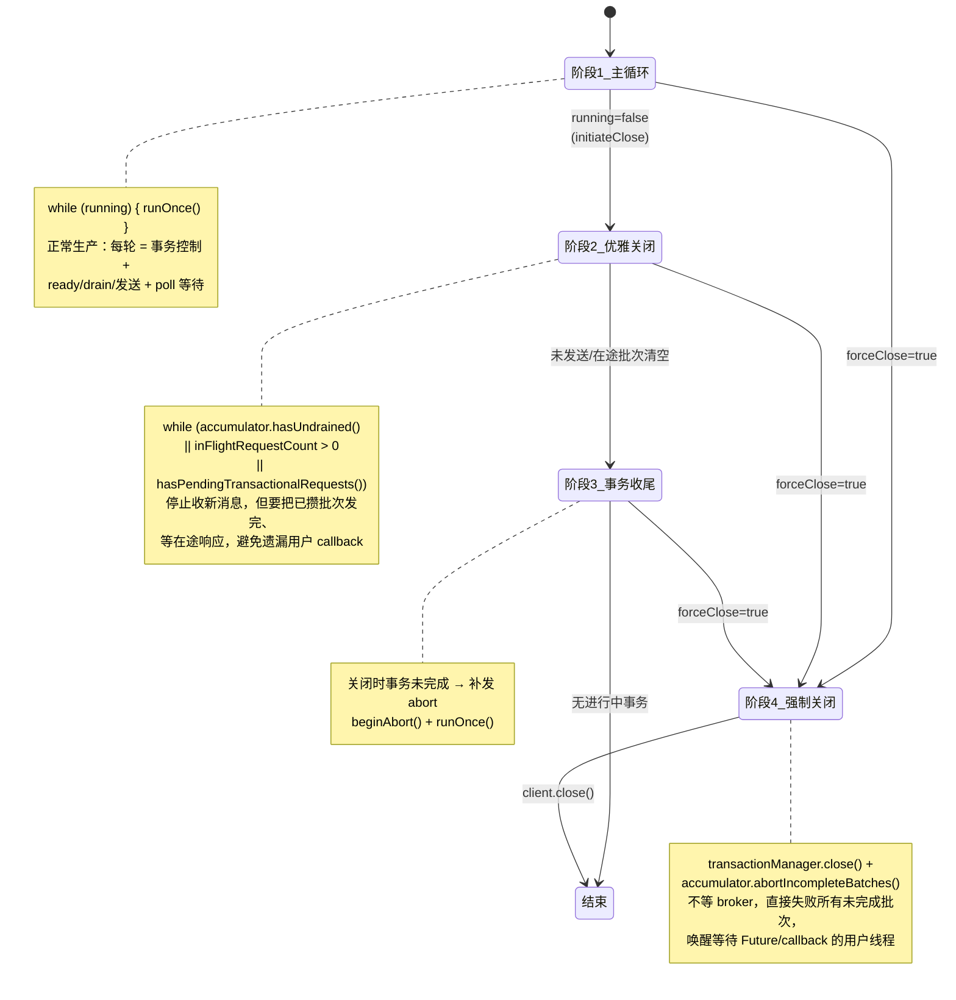

`initiateClose()`（Sender.java:658）的顺序很关键：**先 `accumulator.close()` 再置 `running=false` 再 wakeup**——否则 Sender 退出主循环后仍可能有新消息 append，导致 callback 遗漏。

---

## 10. runOnce 与 sendProducerData

### 10.1 runOnce（Sender.java:353）

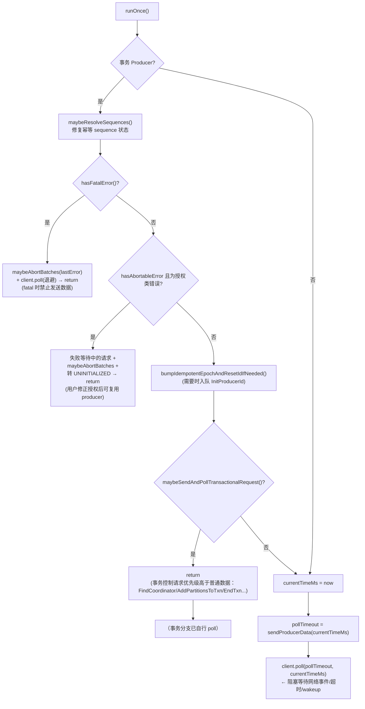

### 10.2 sendProducerData（Sender.java:444）

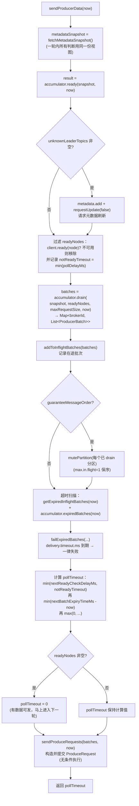

**pollTimeout 的完整语义**（Sender.java:526-541）：

```text
有可发送数据（readyNodes 非空）→ 0：不阻塞，立刻下一轮继续发
否则 = min(
    nextReadyCheckDelayMs,        ← 下一个批次 linger/退避到期时间
    notReadyTimeout,              ← 不可用 broker 最近可重试时间
    nextBatchExpiryTimeMs - now   ← 最近一个 batch 的 delivery timeout 到期时间
)（下限 0）
```

delivery timeout 也参与 poll 上限，避免"批次已经过期但 Sender 还在长时间阻塞"。

---

## 11. sendProduceRequest：构造请求

方法位置：sendProduceRequests Sender.java:1069、sendProduceRequest Sender.java:1079。

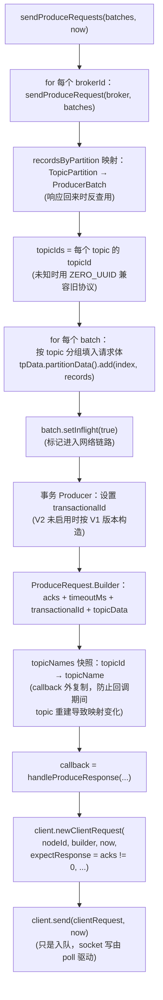

请求的线上结构（一个 broker 一个请求，**跨 topic 合并**）：

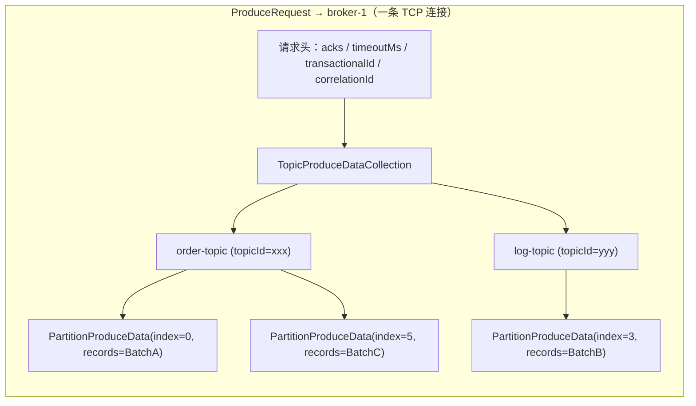

- **acks=0**：`expectResponse=false`，请求写出即本地完成 Future/callback（不代表 broker 落盘，RecordMetadata.offset = -1）；
- **acks=1**：等 leader 写入确认；**acks=all**：等 ISR 全部确认。

---

## 12. handleProduceResponse → completeBatch：响应处理

### 12.1 handleProduceResponse（Sender.java:701）

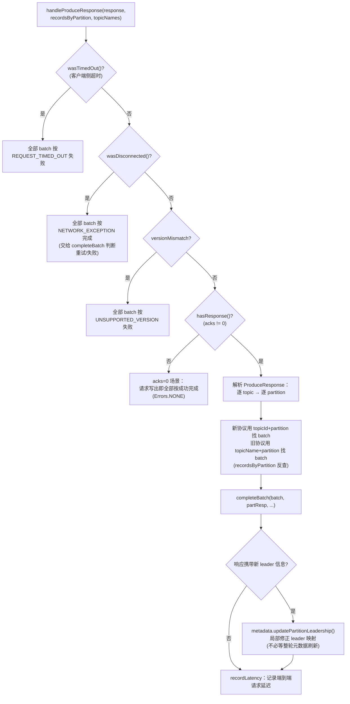

### 12.2 completeBatch 决策树（Sender.java:812）

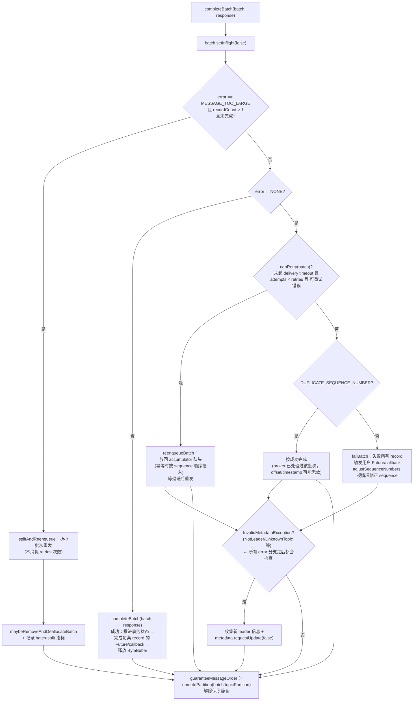

三个容易忽略的细节：

1. **MESSAGE_TOO_LARGE 拆分**：`batch.magic() >= V2 || batch.isCompressed()` 才允许拆；拆分不消耗 retries，且会重置压缩率估计（`CompressionRatioEstimator.setEstimation`，取保守值避免频繁拆分）；
2. **DUPLICATE_SEQUENCE_NUMBER**：幂等场景 broker 已处理过该批次但没保留元数据，客户端只能"按成功完成但 offset/timestamp 无效"；
3. **重试耗尽后不修 sequence**：`adjustSequenceNumbers = batch.attempts() < retries`——重试耗尽时不知道 broker 是否真的接受过该 sequence，乱改反而危险。

---

## 13. 一条消息的一生：完整时序

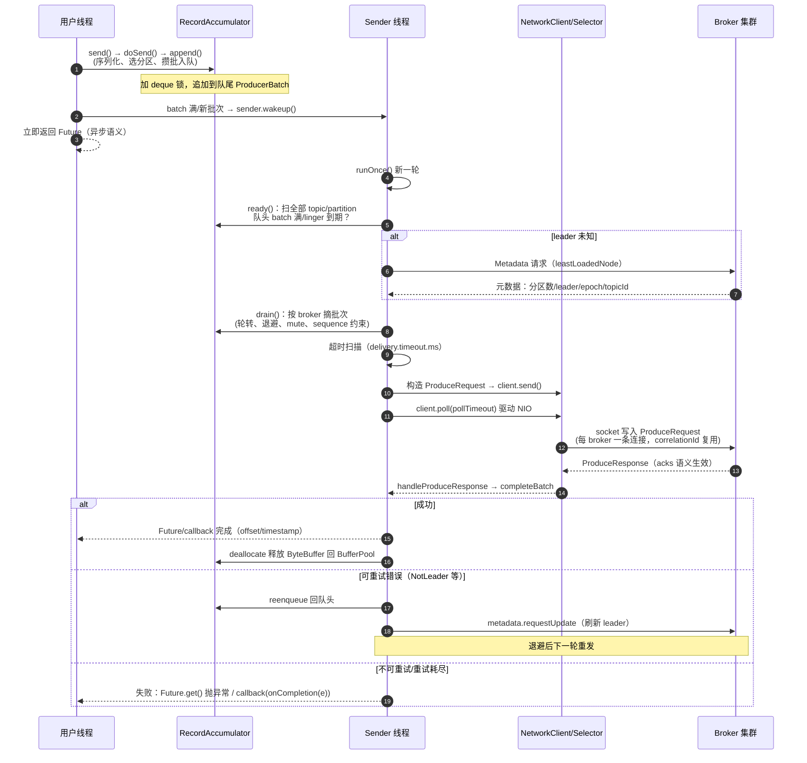

---

## 14. 保序机制专题

Kafka Producer 保证 **同一分区内消息有序**，靠四层机制：

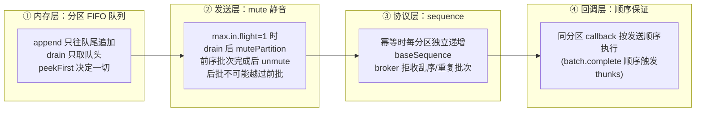

- `guaranteeMessageOrder = (maxInFlightRequests == 1)`（KafkaProducer.java:574）；
- 非幂等 + in-flight > 1 时：**重试可能乱序**（老批次重发时新批次可能已写入）——这是"开启幂等"的经典动机之一（幂等 + broker 端 sequence 排序，客户端可放心提高 in-flight）；
- `DUPLICATE_SEQUENCE_NUMBER` 按成功处理的逻辑也属于这层（第 12.2 节）。

---

## 15. 超时体系专题

| 配置 | 默认值 | 作用范围 | 生效位置 |
|---|---|---|---|
| `max.block.ms` | 60s | 用户线程单次 send 的最大阻塞 | waitOnMetadata + BufferPool 分配（共享预算） |
| `linger.ms` | 0 | 未满批次等待更多消息的攒批时间 | batchReady：`waitedTimeMs >= lingerMs` 才 ready |
| `delivery.timeout.ms` | 120s | batch 从**创建**到完成的总时限（排队+发送+重试） | `getExpiredInflightBatches` + `accumulator.expiredBatches` 双扫描 |
| `request.timeout.ms` | 30s | 单个请求等 broker 响应的时限 | 请求头 timeoutMs；超时按 REQUEST_TIMED_OUT 失败 |
| `retry.backoff.ms` | 100ms | 重试退避基数 | `ExponentialBackoff`：`retryBackoffMs * base^attempts`（上限 `retry.backoff.max.ms`） |
| `metadata.max.age.ms` | 5min | 元数据周期刷新 | Sender poll 的 metadata 到期唤醒 |

时间线示意：

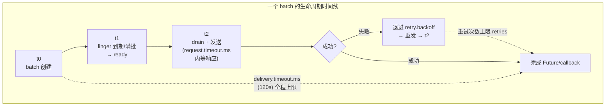

**三个时间的关系**：`delivery.timeout.ms` 是总预算（建议 ≥ `linger.ms + request.timeout.ms + 重试总时长`）；`max.block.ms` 只约束用户线程的**同步阻塞段**（元数据等待 + 内存等待），与后台 Sender 的异步流程无关。

---

## 16. 幂等与事务简述

```mermaid
flowchart TD
    A["enable.idempotence=true 时"] --> B["drain 时分配三元组：<br/>producerId + producerEpoch + baseSequence<br/>(每分区独立递增)"]
    B --> C["broker 端按 sequence 去重/校验顺序<br/>→ 客户端重试安全、in-flight 可提高"]
    A --> D["transactional.id 配置时：<br/>Producer 进入事务模式"]
    D --> E["runOnce 每轮优先处理事务控制请求：<br/>InitProducerId → AddPartitionsToTxn<br/>→ Produce → EndTxn(commit/abort)"]
    E --> F["事务请求优先级高于普通数据<br/>(maybeSendAndPollTransactionalRequest<br/>返回 true 则本轮不发数据)"]
    F --> G["fatal error → 失败全部本地批次<br/>授权类 abortable error → 转 UNINITIALIZED<br/>(用户修正授权后可复用 producer)"]
```

- sequence 在 **drain 时**分配（RecordAccumulator.java:1030 附近），重试批次保留原 sequence（`insertInSequenceOrder` 按 sequence 插回队列）；
- `OutOfOrderSequence` 会标记 sequence 状态 unresolved，**阻止该分区继续 drain 新批次**，直到 TransactionManager 解析前序状态。

---

## 17. 元数据机制专题

```mermaid
flowchart TD
    A["ProducerMetadata<br/>(客户端路由表)"] --> B["内容：broker 列表、<br/>topic→分区数、partition→leader/ISR、<br/>leader epoch、topicId"]
    B --> C["刷新触发点："]
    C --> C1["① 新 topic 首次 send<br/>(waitOnMetadata)"]
    C --> C2["② ready() 发现 unknownLeaderTopics"]
    C --> C3["③ 响应收到 NotLeader/UnknownTopic<br/>等 InvalidMetadataException"]
    C --> C4["④ 周期刷新 metadata.max.age.ms(5min)"]
    C1 --> D["请求发往 leastLoadedNode<br/>(当前负载最低的 broker)"]
    C2 --> D
    C3 --> D
    C4 --> D
    D --> E["响应携带 currentLeader 时：<br/>updatePartitionLeadership 局部修正<br/>(不必等整轮刷新)"]
```

- 元数据请求由 Sender 线程发送（用户线程的 waitOnMetadata 通过 wakeup + awaitUpdate 版本号机制等待）；
- **leader epoch**：用于区分"老 leader 的过期响应"，drain/重试时 `maybeUpdateLeaderEpoch` 记录，broker 端据此拒绝过期写入（`FencedLeaderEpochException`）。

---

## 18. 多集群 × 多 Topic × 多 Partition 工程实践

```mermaid
flowchart TB
    NODE["服务节点"]
    NODE --> PM["ProducerManager（业务侧维护<br/>Map&lt;集群名, KafkaProducer&gt;）"]
    PM --> PA["KafkaProducer-A<br/>├ 1 Sender 线程<br/>├ 32MB BufferPool<br/>└ 1 Selector 管理全部 broker 连接"]
    PM --> PB["KafkaProducer-B<br/>(同上)"]
    PM --> PC["KafkaProducer-C<br/>(同上)"]
    PA -->|"cluster-A"| CA["全部 topic × partition<br/>共享一个 Sender 扫描"]
    PB -->|"cluster-B"| CB["每轮 runOnce 扫自己<br/>accumulator 的所有分区"]
    PC -->|"cluster-C"| CC["topic 之间无切换，<br/>全量扫描 + 按 broker 聚合"]
```

工程注意事项：

1. **资源成本线性**：5 个 Producer = 5 个 Sender 线程 + 5 × buffer.memory + 5 套 broker 连接；内存有限时调小每个 Producer 的 `buffer.memory`；
2. **回调里别串集群**：callback 在各自 Sender 线程执行，别在 callback 里同步调用另一个 Producer 的 `send()`（可能阻塞 max.block.ms，卡住 Sender 线程）；
3. **分区数规模**：`ready()` 每轮全量扫描所有分区队列（空队列也过一遍），数千分区时扫描本身有成本——所以 Sender 用 `nextReadyCheckDelayMs` 尽量"睡到该干活的时候"，KAFKA-16226 就是针对这条热点路径的优化；
4. **"切换集群"的正确姿势**：客户端内部不切换，路由层按消息目标选择 Producer 实例；跨集群复制（灾备/多活）是 MirrorMaker / 流式复制的话题，与 Producer 客户端无关；
5. **topic 分区数变化**：扩容后本地缓存分区数过旧时，waitOnMetadata 会循环等元数据推进（第 4 节）；缩容不存在（Kafka 分区只增不减）。

---

## 19. 关键配置速查表

| 配置 | 默认 | 影响点 |
|---|---|---|
| `bootstrap.servers` | - | 集群入口，仅首次发现用 |
| `acks` | all | 0=不等待；1=leader 确认；all=ISR 全确认 |
| `batch.size` | 16KB | 每 batch 内存块大小，攒批粒度 |
| `linger.ms` | 0 | 未满批次的人工等待，吞吐/延迟跷跷板 |
| `buffer.memory` | 32MB | 全局缓冲池上限，耗尽则 send 阻塞 |
| `max.block.ms` | 60s | 元数据等待 + 内存等待的总预算 |
| `max.request.size` | 1MB | 单请求上限，drain 聚合时控制 |
| `max.in.flight.requests.per.connection` | 5 | 单连接流水线深度；=1 时 mute 保序 |
| `retries` | Integer.MAX_VALUE | 最大重试次数（受 delivery.timeout.ms 约束） |
| `delivery.timeout.ms` | 120s | batch 总交付时限（硬上限） |
| `request.timeout.ms` | 30s | 单请求响应时限 |
| `retry.backoff.ms` | 100ms | 重试退避基数（指数增长） |
| `enable.idempotence` | true | 幂等：producerId/epoch/sequence |
| `compression.type` | none | batch close 时压缩（锁外执行） |
| `metadata.max.age.ms` | 5min | 元数据周期刷新 |
| `partitioner.adaptive.partitioning.enable` | true | 无 key 消息自适应分区切换 |
| `partitioner.availability.timeout.ms` | 0 | broker 多久无法 drain 则分区判不可用 |

---

## 20. 核心方法索引

### KafkaProducer.java

| 方法 | 行号 | 职责 |
|---|---|---|
| `send(record, callback)` | 1115 | 拦截器 → doSend |
| `doSend(record, callback)` | 1163 | 九阶段发送前处理 + 异常策略 |
| `waitOnMetadata(...)` | 1338 | 元数据可用性保证（版本号等待） |
| `partition(...)` | 1742 | 四级分区选择 |

### RecordAccumulator.java

| 方法 | 行号 | 职责 |
|---|---|---|
| `append(...)` | 307 | 攒批入队（sticky 竞态重试 + buffer 分配） |
| `appendNewBatch(...)` | 447 | 新 buffer 建批次 |
| `tryAppend(...)` | 520 | 追加到队尾批次 |
| `expiredBatches(now)` | 567 | 未发送批次超时扫描 |
| `reenqueue(batch, now)` | 598 | 重试批次回队（sequence 顺序插入） |
| `batchReady(...)` | 723 | 单分区 ready 决策树 |
| `partitionReady(...)` | 785 | 逐分区扫描 + adaptive 统计 |
| `ready(...)` | 933 | 全 topic 扫描入口 |
| `shouldBackoff(...)` | 965 | 重试退避判定（leader 切换则跳过） |
| `shouldStopDrainBatchesForPartition(...)` | 986 | 事务/幂等 drain 拦截 |
| `drainBatchesForOneNode(...)` | 1030 | 单 broker 轮转摘批次 |
| `drain(...)` | 1158 | 按 broker 聚合入口 |
| `mutePartition / unmutePartition` | 1402/1407 | 保序静音控制 |

### Sender.java

| 方法 | 行号 | 职责 |
|---|---|---|
| `run()` | 276 | 生命周期四阶段 |
| `runOnce()` | 353 | 单轮：事务控制 + 数据 + poll |
| `sendProducerData(now)` | 444 | ready→drain→超时→请求→pollTimeout |
| `maybeSendAndPollTransactionalRequest()` | 551 | 事务控制请求（优先于数据） |
| `initiateClose()` | 658 | 优雅关闭入口（先关 accumulator） |
| `handleProduceResponse(...)` | 701 | 响应解析与 batch 反查 |
| `completeBatch(...)` | 812 | 成功/重试/拆分/失败决策树 |
| `reenqueueBatch(...)` | 904 | 重试回队 |
| `canRetry(...)` | 1056 | 重试条件三连：超时/次数/可重试错误 |
| `sendProduceRequests(...)` | 1069 | 按 broker 发送 |
| `sendProduceRequest(...)` | 1079 | 构造单个 ProduceRequest |
| `wakeup()` | 1175 | 打断 poll 阻塞（非重启线程） |

---

## 附：阅读建议

1. **先读骨架**：`KafkaProducer#doSend`（入队侧）→ `Sender#runOnce/sendProducerData`（发送侧）→ `RecordAccumulator#ready/drain`（两侧的交汇点）；
2. **再读细节**：`batchReady`（ready 判定的全部条件）→ `completeBatch`（响应的全部分支）→ `partitionReady`（热点路径优化）；
3. **最后读扩展**：幂等/事务（TransactionManager）、NetworkClient 连接管理（ready/poll/Selector）、BufferPool 内存分配细节。
